# 中国A股发展历程与底层逻辑：深度调研报告

> **调研日期**：2026年6月7日\
> **调研方法**：多源并行搜索 → 对抗性验证 → 综合报告\
> **覆盖维度**：历史发展、市场结构、定价逻辑、跨市场对比、运行框架、制度改革

***

## 全景预览：A股底层逻辑总览

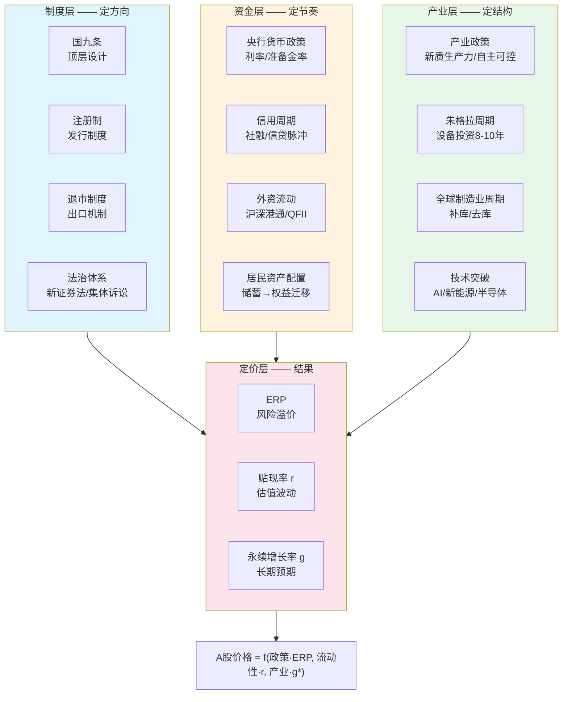
```mermaid
graph TB
    subgraph 制度层["制度层 —— 定方向"]
        A1["国九条<br/>顶层设计"]
        A2["注册制<br/>发行制度"]
        A3["退市制度<br/>出口机制"]
        A4["法治体系<br/>新证券法/集体诉讼"]
    end
    subgraph 资金层["资金层 —— 定节奏"]
        B1["央行货币政策<br/>利率/准备金率"]
        B2["信用周期<br/>社融/信贷脉冲"]
        B3["外资流动<br/>沪深港通/QFII"]
        B4["居民资产配置<br/>储蓄→权益迁移"]
    end
    subgraph 产业层["产业层 —— 定结构"]
        C1["产业政策<br/>新质生产力/自主可控"]
        C2["朱格拉周期<br/>设备投资8-10年"]
        C3["全球制造业周期<br/>补库/去库"]
        C4["技术突破<br/>AI/新能源/半导体"]
    end
    subgraph 定价层["定价层 —— 结果"]
        D1["ERP<br/>风险溢价"]
        D2["贴现率 r<br/>估值波动"]
        D3["永续增长率 g<br/>长期预期"]
    end

    制度层 --> 定价层
    资金层 --> 定价层
    产业层 --> 定价层
    定价层 --> E["A股价格 = f(政策·ERP, 流动性·r, 产业·g*)"]

    style 制度层 fill:#e1f5fe
    style 资金层 fill:#fff3e0
    style 产业层 fill:#e8f5e9
    style 定价层 fill:#fce4ec
```

> **核心公式**：A股的运行逻辑 = **政策周期 × 流动性周期 × 产业周期**，三者分别对应DCF模型中的**风险溢价(ERP)**、**贴现率(r)和**永续增长率(g\*)。理解这个三维框架，是理解A股一切现象的起点。

***

## 目录

1. [A股的历史发展阶段](#1-a股的历史发展阶段)
2. [A股的市场结构特征](#2-a股的市场结构特征)
3. [A股定价的底层逻辑](#3-a股定价的底层逻辑)
4. [A股与成熟市场的核心差异](#4-a股与成熟市场的核心差异)
5. [理解A股运行规律的关键框架](#5-理解a股运行规律的关键框架)
6. [近年来的重大改革及影响](#6-近年来的重大改革及影响)
7. [总结：A股的底层逻辑是什么](#7-总结a股的底层逻辑是什么)

***

## 1. A股的历史发展阶段

### 1.1 总体脉络

中国A股市场从1990年诞生至今，经历了一条\*\*"从无到有、从小到大、从封闭到开放、从审批到注册"**的演进路径。中国人民大学吴晓求教授将这一历程概括为**"三座丰碑"\*\*：沪深交易所创设（第一座）、股权分置改革（第二座）、注册制改革（第三座）。

#### 关键里程碑时间轴

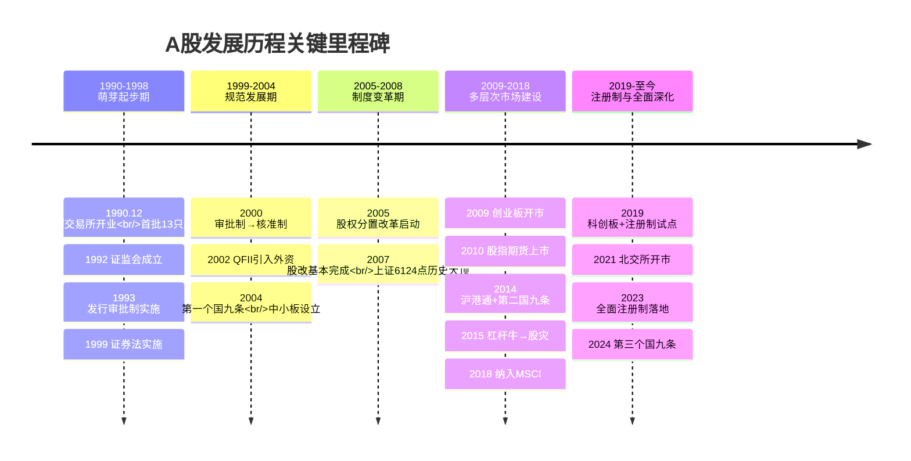
```mermaid
timeline
    title A股发展历程关键里程碑
    1990-1998 萌芽起步期
        : 1990.12 沪深交易所开业<br/>首批13只股票
        : 1992 证监会成立
        : 1993 发行审批制实施
        : 1999 证券法实施
    1999-2004 规范发展期
        : 2000 审批制→核准制
        : 2002 QFII引入外资
        : 2004 第一个国九条<br/>中小板设立
    2005-2008 制度变革期
        : 2005 股权分置改革启动
        : 2007 股改基本完成<br/>上证6124点历史大顶
    2009-2018 多层次市场建设
        : 2009 创业板开市
        : 2010 股指期货上市
        : 2014 沪港通+第二国九条
        : 2015 杠杆牛→股灾
        : 2018 纳入MSCI
    2019-至今 注册制与全面深化
        : 2019 科创板+注册制试点
        : 2021 北交所开市
        : 2023 全面注册制落地
        : 2024 第三个国九条
```

#### 上证指数全景图（对数坐标，1990-2025）

```
  ┊ 上证指数 (对数坐标)
  ┊
6000┼                                              ╭─6124(2007.10)
    ┊                                           ╭──╯
4000┼                                    ╭─5178(2015.06)──╮
    ┊                                ╭──╯                  ╲
2000┼                    ╭─2245(2001)╯                      ╲
    ┊    ╭─1558(1993)   ╱                                      ╲
1000┼  ╭╯         ╲   ╱                                          ╲
    ┊ ╱            ╲╱                                              ╲
 500┼╱  325(1994)  998(2005)                                          ╲
    ┊                                                         ╭────────
 200┼                                                      ╭──╯
    ┊                                                  ╭───╯
 100┼────┬────┬────┬────┬────┬────┬────┬────┬────┬────┬────┬────
   1990  1993  1996  1999  2002  2005  2008  2011  2014  2017  2020  2023

  标注：
  ★ 1990.12: 上证100点起步    ★ 2005: 998点，股改起点
  ★ 2007.10: 6124点（历史最高）★ 2015.06: 5178点（杠杆牛顶）
  ★ 2024.02: 2635点阶段低点
```

#### 市场规模演进数据

| 指标      | 1990年   | 2000年    | 2010年    | 2015年    | 2020年       | 2025年（估）    |
| ------- | ------- | -------- | -------- | -------- | ----------- | ----------- |
| 上市公司数   | 13家     | \~1,100家 | \~2,100家 | \~2,800家 | \~4,200家    | **>5,300家** |
| 总市值（万亿） | \~0.001 | \~4.8    | \~26.5   | \~53.1   | \~79.7      | **\~85-90** |
| 投资者账户数  | \~数万    | \~5,800万 | \~1.33亿  | \~2.15亿  | \~1.78亿(有效) | **>2.2亿**   |
| 年度IPO数量 | 13      | \~140    | \~349    | \~220    | \~396       | \~300+      |

### 1.2 五个发展阶段

#### 阶段一：萌芽起步期（1990—1998）——"姓资姓社"的争论中诞生

> **阶段特征**：在意识形态争论中艰难起步，市场规模极小，制度几乎空白，处于"试点"状态。

| 时间            | 关键事件                                                                         | 深层意义                        |
| ------------- | ---------------------------------------------------------------------------- | --------------------------- |
| **1990年12月**  | 上交所（12.19）、深交所（12.1试营业）开业，首批仅13只股票（沪市"老八股"：飞乐音响、爱使电子、申华电工等；深市"老五股"：深发展、深万科等） | 邓小平"证券、股市要坚决地试"的政治背书下的产物    |
| **1992年1-2月** | 邓小平南巡讲话，明确"证券、股市这些东西究竟好不好……要坚决地试"                                            | 终结"姓资姓社"争论，为资本市场正名          |
| **1992年5月**   | 上证指数单日暴涨105%，"8·10"深圳新股认购事件                                                  | 暴露出制度严重滞后于市场需求——排队三天三夜抢购认购表 |
| **1992年10月**  | 国务院证券委员会和证监会成立                                                               | 统一的监管体系从无到有，刘鸿儒任首任主席        |
| **1993年**     | 股票发行实行**审批制**，"额度管理"阶段——国务院每年下达总发行额度，分配给各省市                                  | "跑部钱进"的根源——上市指标是稀缺资源        |
| **1996年**     | "十二道金牌"事件——证监会连续发文打压股市过热，上证从1258跌至855点                                       | A股"政策市"基因的早期显现              |
| **1998年4月**   | 国务院机构改革，证券委与证监会合并，集中统一监管体系形成                                                 | 监管权力由分散走向集中                 |
| **1999年7月**   | 《证券法》正式实施                                                                    | 证券市场终于有了"基本法"——此前主要靠行政规章运行  |

**阶段一的关键数字**：

- 1990年总市值：约10亿元人民币（不到单只美股中等市值）
- 1998年总市值：约1.95万亿元（8年增长近2000倍，主要是扩容而非股价上涨）
- 1999年上市公司：约950家
- 投资者开户数：从零增长至约4000万户

> **制度基因**：审批制+额度管理奠定了此后二十多年A股"壳价值"的制度基础——上市资格本身成为一种稀缺资产。这一基因至今仍在影响A股定价（ST股壳价值、借壳上市等）。

#### 阶段二：规范发展期（1999—2004）——从"无序"走向"有序"

> **阶段特征**：在"5·19"行情中开启，在四年熊市中沉淀，在"国九条"中明确方向。这是A股从野蛮生长到制度化治理的转折期。

| 时间           | 关键事件                                             | 深层意义                                            |
| ------------ | ------------------------------------------------ | ----------------------------------------------- |
| **1999年5月**  | "5·19"行情爆发——上证从1047点飙升至1756点（30个交易日涨67%），科技网络股狂潮 | 人民日报发表《坚定信心，规范发展》社论背书做多——"政策造牛"的经典案例            |
| **2000年3月**  | 发行制度从**审批制过渡到核准制**（通道制→保荐制，标志：取消额度管理）            | 首次将上市判断权从政府转移到中介机构                              |
| **2001年6月**  | 国务院发布《减持国有股筹集社会保障资金管理暂行办法》                       | 引发市场恐慌——国有股按市价减持意味着天量抛压                         |
| **2001年10月** | 证监会紧急叫停国有股减持                                     | "纠错但已崩"——上证已从2245跌至1514点，宣告四年熊市开始               |
| **2002年12月** | QFII制度正式引入，瑞银华宝为首家                               | A股对外开放的第一步，但初期额度极其有限                            |
| **2003年10月** | 《证券投资基金法》通过                                      | 公募基金行业从此有法可依，为机构化铺路                             |
| **2004年1月**  | 国务院出台**第一个"国九条"**——《关于推进资本市场改革开放和稳定发展的若干意见》      | 首次将资本市场发展上升到国家战略层面，但具体路径尚未明确；首次提出"积极稳妥解决股权分置问题" |
| **2004年5月**  | 深交所设立**中小板**，首批8家                                | 为民营企业、中小企业开辟融资渠道，也是创业板"试验田"                     |
| **2004年全年**  | 上证从1783点跌至1266点                                  | 经历股权分置焦虑下的漫长探底，市场信心极度脆弱                         |

**阶段二的关键背景**：**股权分置——A股的"原罪"**

```
在股权分置改革前（1990-2005），A股上市公司的股权结构是分裂的：

┌──────────────────────────────────────────────────┐
│              上市公司总股本                        │
├────────────────────┬─────────────────────────────┤
│   流通股 (~1/3)    │     非流通股 (~2/3)          │
│   可在二级市场交易  │   不可流通（国有股、法人股）    │
│   投资者用现金申购   │   按净资产折股（成本极低）     │
│   大股东不持有       │   大股东全部持有              │
└────────────────────┴─────────────────────────────┘

后果：
1. 大股东利益与股价无关 → 无心提升股价 → 热衷掏空上市公司
2. 2/3的股份不能流通 → 市场定价机制失灵 → 小盘股操纵盛行
3. 非流通股若按市价减持 → 对二级市场形成巨大抛压预期
4. 这是2001-2005四年熊市的制度根源
```

**阶段二的关键数字**：

- 上证指数区间：1047（"5·19"起点）→ 2245（2001年顶）→ 998（2005年股改前底）
- 最大回撤：55.5%（2245→998，历时约4年）
- QFII首批额度：仅约40亿美元（vs 目前超1000亿美元）

#### 阶段三：重大制度变革期（2005—2008）——"股改牛"与制度套利

> **阶段特征**：A股历史上最重要的制度变革——股权分置改革，催生了迄今为止最大的牛市（6124点），也暴露了全流通时代的新风险。

| 时间              | 关键事件                                    | 深层意义                              |
| --------------- | --------------------------------------- | --------------------------------- |
| **2005年4月29日**  | 证监会发布《关于上市公司股权分置改革试点有关问题的通知》，**股改正式启动** | 三一重工等4家公司首批试点                     |
| **2005年6月**     | 上证触底998.23点后开启反转                        | "股改底"——送股对价让流通股东获得约30%的额外股份       |
| **2005年9月**     | 股改全面推进，《上市公司股权分置改革管理办法》出台               | 对价方案：每10股流通股获送约3股                 |
| **2006年**       | 上证全年涨130%——"股改对价+盈利增长+人民币升值"三重共振        | 公募基金规模爆发，散户跑步入场                   |
| **2007年5月**     | "5·30"半夜上调印花税（0.1%→0.3%），上证5天跌21%       | A股"政策调控"的典型操作——用税收工具直接干预市场        |
| **2007年8月**     | 美国次贷危机蔓延，但A股仍在惯性冲高                      | 全球危机与A股狂热的背离                      |
| **2007年10月16日** | 上证触及**6124.04点**历史峰值                    | 静态PE超70倍，PB超7倍——估值已完全脱离基本面        |
| **2007年11月**    | 中国石油上市（首日48.6元），随后暴跌80%+                | "问君能有几多愁，恰似满仓中石油"——48元买入者15年后仍未解套 |
| **2007年底**      | 股改基本完成：1333家公司完成股改，占比98%                | A股正式进入**全流通时代**                   |
| **2008年**       | 上证从5261跌至1820点（全年跌65.4%），史上最大年度跌幅       | 次贷危机+大小非解禁+估值泡沫三重打击               |

**股权分置改革的核心机制——"对价"**

```
股改的交易结构：
非流通股股东向流通股股东支付"对价"（通常为送股）
以换取非流通股的"流通权"

典型案例：三一重工
方案：每10股流通股获送3.5股 + 8元现金
结果：流通股东获得约35%的额外股份作为补偿

为何要送股？——非流通股原本按净资产折股（成本远低于流通股东）。
若直接全流通而不补偿，流通股东将面临天量低成本筹码的抛售。

全体流通股东获得的"对价红包"约为总市值的30%——这直接构成了2005-2007年大牛市的一部分收益。
```

**全流通后的新问题——"大小非解禁"**：

```
全流通 ≠ 全部立即流通。股改设置了限售期：

"大非"（持股5%以上）：股改完成36个月后可逐步减持
"小非"（持股5%以下）：股改完成12个月后可逐步减持

2008年是"大小非"解禁的第一个高峰期
→ 产业资本首次获得在二级市场减持套现的通道
→ 大量持股成本接近于零的筹码涌入市场
→ 这是2008年A股跌得比全球金融危机中其他市场更惨的制度性原因之一

从此以后，"减持"成为A股永恒的敏感词——每一轮反弹都面临产业资本减持的压力。
```

**阶段三的关键数字**：

- 上证区间：998（2005底）→ 6124（2007顶）→ 1664（2008底）
- 牛市涨幅：514%（998→6124），约28个月
- 熊市跌幅：73%（6124→1664），约12个月
- 股改覆盖：1333家，送股平均对价约每10股送3股
- 2007年散户开户峰值：单月新增超900万户

#### 阶段四：多层次市场体系建设期（2009—2018）——杠杆、熔断与国际化

> **阶段特征**：后金融危机时代的"四万亿"反弹、创业板诞生、杠杆造牛、熔断灾难、MSCI纳入——这是A股制度创新最密集、也是风险事件最高发的十年。

| 时间              | 关键事件                                 | 深层意义                                       |
| --------------- | ------------------------------------ | ------------------------------------------ |
| **2009年10月30日** | **创业板开市**，首批28家公司                    | 市盈率平均56.7倍，首日平均涨幅106%——高估值基因从一开始就注入了       |
| **2010年4月16日**  | 沪深300股指期货上市                          | 首次有了真正的做空工具——机构可通过期指对冲风险，散户只能做多            |
| **2013年初**      | **新三板**（全国股转系统）揭牌                    | 为无法上市的企业提供挂牌场所，成为北交所的前身                    |
| **2014年5月**     | 国务院第二个"国九条"                          | 首次明确提出"积极稳妥推进股票发行注册制改革"                    |
| **2014年7月**     | A股开启"杠杆牛"——融资融券余额从4000亿飙升至2.2万亿      | 场外配资、伞形信托大规模入市——杠杆率远超监管部门认知                |
| **2014年11月**    | **沪港通**正式启动                          | 外资通过香港可直接买入A股，额度初期3000亿——双向开放里程碑           |
| **2014年11月**    | 央行降息开启宽松周期                           | "改革牛"+"杠杆牛"+"水牛"三重共振                       |
| **2015年6月12日**  | 上证触及**5178.19点**——创业板PE达135倍         | 全市场两融余额2.27万亿，日均换手率超5%                     |
| **2015年6-8月**   | **股灾**：上证从5178跌至2850（跌45%），千股跌停频现    | 去杠杆踩踏——配资强平→股价大跌→更多强平的死亡螺旋                 |
| **2015年7-9月**   | 国家队万亿资金入场救市、限制减持、暂停IPO、公安部介入调查"恶意做空" | "政策市"的极端表现——行政手段全面接管市场                     |
| **2016年1月**     | **熔断灾难**——1月4日和1月7日两次触发熔断，全天仅交易15分钟  | 熔断机制上线仅4天即被叫停——制度设计的经典失败案例                 |
| **2016年3月**     | 证监会换帅——刘士余接替肖钢                       | 开启"强监管"周期：打击壳炒作（炒壳概念股应声暴跌）、整治险资举牌（宝能万科事件）  |
| **2016年12月**    | **深港通**开通                            | 互联互通覆盖深市，外资渠道进一步拓宽                         |
| **2017年**       | "漂亮50"行情——少数白马股上涨，3000+股票下跌          | A股史上最极端的结构分化：贵州茅台涨111%，工商银行涨47%，但中位数股票跌16% |
| **2018年**       | A股纳入MSCI，但全年上证跌24.6%（贸易战+去杠杆）        | "入摩"利好被宏观悲观对冲，外资开始系统性配置A股                  |

**2015年股灾的杠杆传导机制（理解A股风险的经典案例）**：

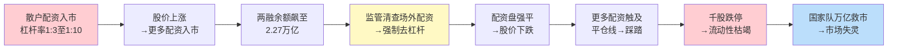
```mermaid
graph LR
    A["散户配资入市<br/>杠杆率1:3至1:10"] --> B["股价上涨<br/>→更多配资入市"]
    B --> C["两融余额飙至<br/>2.27万亿"]
    C --> D["监管清查场外配资<br/>→强制去杠杆"]
    D --> E["配资盘强平<br/>→股价下跌"]
    E --> F["更多配资触及<br/>平仓线→踩踏"]
    F --> G["千股跌停<br/>→流动性枯竭"]
    G --> H["国家队万亿救市<br/>→市场失灵"]

    style A fill:#ffcdd2
    style D fill:#fff9c4
    style G fill:#ffcdd2
    style H fill:#bbdefb
```

> **教训**：A股的高散户占比+T+1+涨跌停，在面临杠杆去化压力时会形成**极度脆弱的踩踏螺旋**——流动性在关键时刻反而被制度"锁住"。

**2016年熔断灾难——制度设计的反面教材**：

```
时间线：
2016.1.1  熔断机制正式实施（阈值5%/7%）
2016.1.4  新年首日，沪深300跌5%触发第一次熔断
          恢复交易后继续大跌7%，触发第二次熔断
          全天仅交易约2小时
2016.1.7  再度触发两次熔断，全天仅交易15分钟
2016.1.8  证监会紧急叫停熔断机制

问题出在哪？
1. 阈值设计过低（5%/7%）——美股阈值是7%/13%/20%
2. 磁吸效应：投资者害怕熔断后无法交易 → 抢在熔断前抛售 → 加速触发熔断
3. 中国T+1+涨跌停本已限制了流动性 → 熔断进一步锁死 → 恐慌放大而非缓解
4. 与美国T+0+无涨跌停的市场结构完全不兼容
```

**阶段四的核心数据**：

- 创业板首批28家，截至2025年创业板上市公司超1,300家
- 2014-2015年两融余额：4000亿→2.27万亿→8000亿（暴涨暴跌）
- 2015年股灾：上证最大回撤45%，创业板最大回撤56%
- 国家队救市规模：约1.5-2万亿元
- 2017年"A50 vs 要你命3000"：前50只股票平均涨幅>40%，其余3000+只平均下跌>10%

#### 阶段五：注册制改革与全面深化期（2019—至今）——制度基因的重塑

> **阶段特征**：科创板的诞生标志着"硬科技"得到资本市场的系统定价；注册制从试验到全面铺开改变了A股的"供给侧"基因；第三个国九条明确了"投资市"定位。这是A股制度基因正在被系统性重塑的时期。

| 时间                   | 关键事件                         | 深层意义                                                   |
| -------------------- | ---------------------------- | ------------------------------------------------------ |
| **2018年11月5日**       | 习近平在进博会宣布设立**科创板并试点注册制**     | 最高领导亲自宣布——科创板从一开始就带有强烈的政治意志                            |
| **2019年7月22日**       | **科创板首批25家公司上市**——注册制试点"第一步" | 首批公司首日平均涨幅140%，平均PE约120倍；中微公司、澜起科技等半导体企业成为日后"国产替代"行情起点 |
| **2020年3月**          | 新《证券法》实施                     | 欺诈发行最高罚2000万→无上限；引入"中国版集体诉讼"制度                         |
| **2020年8月24日**       | **创业板注册制**首批18家——注册制扩至存量板块   | 涨跌幅同步放宽至±20%，存量老股一并扩板                                  |
| **2021年4月**          | 深交所主板与中小板合并                  | 简化板块层次，为全面注册制做准备                                       |
| **2021年9月**          | **北交所**开市——71家精选层平移+10家新股    | 专注"专精特新"，实施注册制，涨跌幅±30%                                 |
| **2022年11月**         | 证监会主席易会满提出"中特估"——中国特色估值体系    | 引发2023年"中字头"行情：中国移动市值一度超越茅台                            |
| **2023年2月17日**       | 证监会发布全面注册制制度规则（165部）         | 主板注册制规则落地                                              |
| **2023年4月10日**       | **主板注册制首批10家上市**——全面注册制正式落地  | 核准制画上句号——"壳价值"的制度基础被消除                                 |
| **2024年2月**          | 上证跌至2635点（救市底）               | 中央汇金宣布"持续加大ETF增持力度"——通过宽基ETF托底的"新型救市"                  |
| **2024年4月**          | 国务院印发**第三个"国九条"**            | 核心词从"发展"→"健康发展"→"高质量发展"，明确未来5年/2035年/本世纪中叶三阶段目标        |
| **2024年9月**          | 央行+证监会+金融监管总局联合发布一揽子政策       | 创设"互换便利""股票回购增持再贷款"两大工具——央行首次直接为资本市场提供流动性支持            |
| **2024年9月24日-10月8日** | 上证从2770飙升至3674（6个交易日涨32.6%）  | 政策"火箭筒"式的情绪释放——成交额3.45万亿创历史天量                          |

**第三个"国九条"的九大要点（2024版 vs 前两版）**：

| 要点          | 核心内容                                | 与前两版的核心差异           |
| ----------- | ----------------------------------- | ------------------- |
| 总体要求        | 未来5年形成资本市场高质量发展框架，2035年建成与金融强国匹配的市场 | 首次明确分阶段目标，时间节点清晰    |
| 严把发行上市准入关   | 提高主板/创业板上市标准，科创板强化"硬科技"定位           | 从"宽进"到"严进"——注册制≠不审核 |
| 严格上市公司持续监管  | 打击财务造假、规范减持、强化分红                    | 减持规则全面收紧            |
| 加大退市监管力度    | 加快形成应退尽退、及时出清的格局                    | 退市力度前所未有的强化         |
| 加强证券基金机构监管  | 校正行业机构定位，纠治拜金主义                     | 直接点名行业文化问题          |
| 加强交易监管      | 查处操纵市场、恶意做空                         | 量化交易被纳入监管框架         |
| 大力推动中长期资金入市 | 优化社保、险资、年金入市机制                      | 从"鼓励"变为"建立机制"       |
| 全面深化改革开放    | 完善多层次市场、互联互通                        | —                   |
| 形成高质量发展合力   | 法治供给、投资者保护、跨部门协调                    | 首次强调"央地协同"监管        |

> **阶段五的核心矛盾**：全面注册制后市场快速扩容，2021-2024年间A股上市公司从4100家飙升至5300+家，年均IPO超300家。但退市速度远跟不上——市场从"注水"变成了"蓄水但排水不畅"——这是2024年第三个国九条将退市列为核心议题的背景。

### 1.3 制度变革主线

```
发行制度：审批制(1993) → 核准制(2000) → 注册制试点(2019) → 全面注册制(2023)
股权结构：半流通时代 → 股权分置改革(2005-2007) → 全流通时代
市场层次：主板 → 中小板(2004) → 创业板(2009) → 新三板(2013) → 科创板(2019) → 北交所(2021)
```

### 1.4 三大"国九条"定位对比

| 次序  | 时间      | 核心主题        | 历史任务                    |
| --- | ------- | ----------- | ----------------------- |
| 第一个 | 2004年1月 | **"发展"**    | 推动股权分置改革，将资本市场提升至国家战略高度 |
| 第二个 | 2014年5月 | **"健康发展"**  | 推进注册制改革，健全多层次市场体系       |
| 第三个 | 2024年4月 | **"高质量发展"** | 强监管、防风险，建设与金融强国相匹配的资本市场 |

***

## 2. A股的市场结构特征

### 2.1 投资者结构：散户主导交易，产业资本主导持仓

这是理解A股最核心的结构性特征。A股不是一个"机构市"，而是一个"持仓以产业资本和散户为主、交易以散户为主、定价权高度碎片化"的市场。

#### 投资者结构全景图

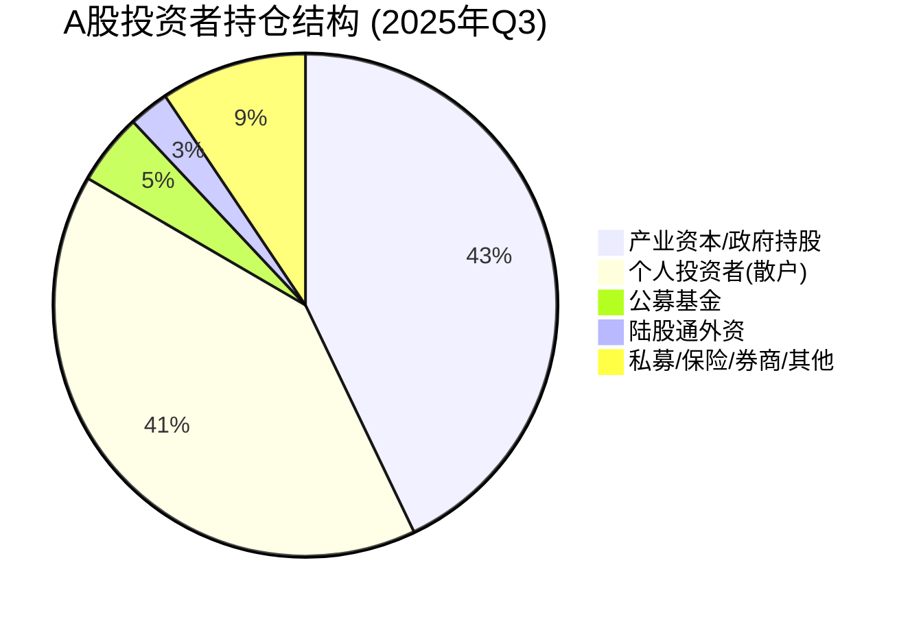
```mermaid
pie title A股投资者持仓结构 (2025年Q3)
    "产业资本/政府持股" : 42.9
    "个人投资者(散户)" : 40.5
    "公募基金" : 4.6
    "陆股通外资" : 2.6
    "私募/保险/券商/其他" : 9.4
```

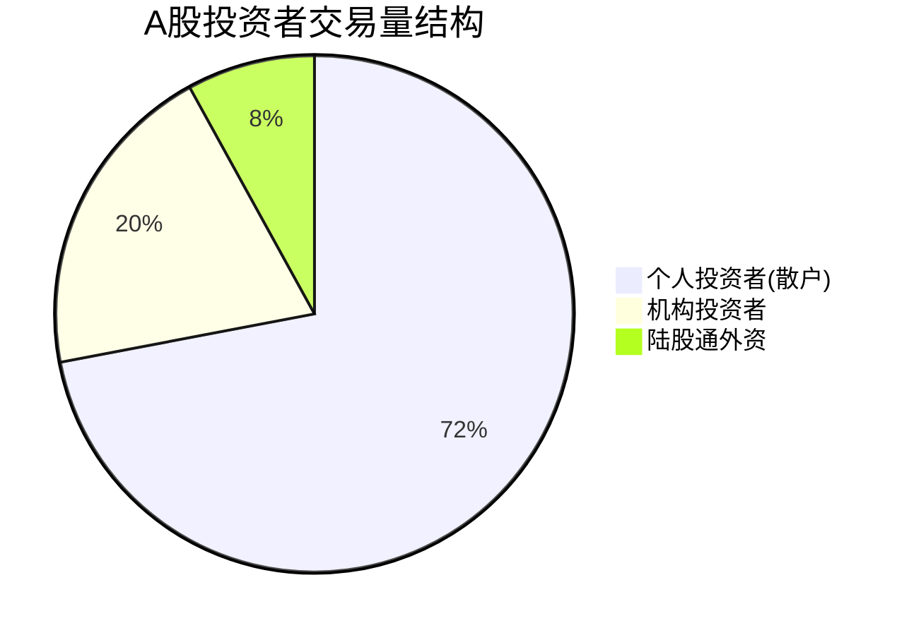
```mermaid
pie title A股投资者交易量结构
    "个人投资者(散户)" : 72
    "机构投资者" : 20
    "陆股通外资" : 8
```

> **核心矛盾**：持仓结构显示产业资本（约43%）和散户（约40%）是双主体，但交易层面散户占比70%+。这意味着——**价格由散户情绪边际定价，筹码的最终归属由产业资本行为决定**。产业资本的增减持方向，是A股中长期走势最核心的"暗线"。

#### 投资者账户分布

| 维度              | 数据         | 含义                          |
| --------------- | ---------- | --------------------------- |
| 个人投资者占账户总数      | **99.76%** | 机构账户仅占0.24%（约55万户 vs 2.2亿户） |
| 资金不足10万元的投资者    | **71.86%** | 超七成账户是"微型账户"——抗风险能力极弱       |
| 93%的账户资金不超过50万元 | —          | 绝大多数参与者不具备专业投资条件            |
| 机构投资者账户占比       | 0.24%      | 但持有流通市值约20%（含一般法人则超60%）     |

#### 专业机构投资者进一步拆解

| 机构类型    | 持股市值（万亿元，估） | 占比   | 关键特征                       |
| ------- | ----------- | ---- | -------------------------- |
| 公募基金    | \~4.4       | 4.6% | 主动权益类持续缩水，ETF被动投资崛起        |
| 陆股通（外资） | \~2.5       | 2.6% | 偏好消费+新能源龙头，重仓茅台/宁德/美的      |
| 私募基金    | \~1.5       | 1.6% | 策略多元，量化私募（幻方/九坤/灵均）管理规模超千亿 |
| 保险资金    | \~1.2       | 1.3% | 偏好高股息/高ROE/低波动，红利股核心买家     |
| 社保/养老金  | \~0.5       | 0.5% | 长期资金但体量偏小                  |

> **关键趋势**：境内专业机构持股占比从16.59%（2021Q1）升至18.46%（2025Q1），但距离美股机构持股占比（约55%）仍有巨大差距。

### 2.2 盈亏极化的结构性不平等——"散户绞肉机"

这是A股最残酷但最真实的数据画像：

| 账户规模       | 盈利比例      | 亏损比例     | 含义           |
| ---------- | --------- | -------- | ------------ |
| 10万元以下账户   | 仅**2%**   | **98%**  | 微型散户几乎系统性亏损  |
| 10-50万元    | \~15-20%  | \~80-85% | 中小散户盈亏比严重失衡  |
| 50-300万元   | \~35-50%  | \~50-65% | 中等资金开始出现分化   |
| 300-1000万元 | \~60-80%  | \~20-40% | 高净值投资者已具显著优势 |
| 1000万元以上账户 | **99.1%** | <1%      | 大资金几乎系统性盈利   |

```
为什么会出现这种极端分化？——五重结构性劣势

1. 信息劣势
   机构：调研预约+卖方路演+产业链验证+卫星数据
   散户：F10公告（往往滞后3-6个月）+ 股吧传闻

2. 工具劣势
   机构：股指期货对冲+期权+融券做空+大宗交易折价买入
   散户：只能做多，T+1当天买入被套无法止损

3. 速度劣势
   量化机构：微秒级（千分之一毫秒）信号+执行
   散户：至少300毫秒延迟 → 股价已波动2%-5%

4. 认知劣势
   机构：研究团队覆盖+财务模型+行业数据库
   散户：看K线+追涨停+听大V推荐

5. 行为劣势
   散户年换手率>500%（机构5-10倍）
   频繁交易 → 印花税+佣金吞噬本金3%-5%/年
   涨时贪婪不卖、跌时恐慌割肉——经典"高买低卖"
```

#### 散户行为的心理学基础：三个核心偏误

| 偏误         | 表现         | 在A股的具体体现                            |
| ---------- | ---------- | ----------------------------------- |
| **过度交易偏误** | 过度自信导致频繁交易 | 散户年换手500%+，每2-3个月清仓一次，"不交易就难受"      |
| **处置效应**   | 赚一点就卖，亏了死扛 | 盈利股平均持有15天，亏损股平均持有90天——"截断利润，让亏损奔跑" |
| **羊群效应**   | 跟风追涨，恐慌割肉  | 涨停板次日散户净买入最多（追板），跌停板散户净卖出最多（踩踏）     |

> **核心数据**：小资金投资者平均持股周期约**30天**（美股约300天），高频交易加之高昂的隐性成本（印花税0.1%+佣金+冲击成本），年化交易费用可吞噬小资金本金的3%-5%。在长期"七亏二平一赚"的市场中，光是交易成本就足以让散户跑输。

### 2.3 交易机制深度解析：T+1与涨跌停——保护还是陷阱？

#### T+1制度：被锁定的一天

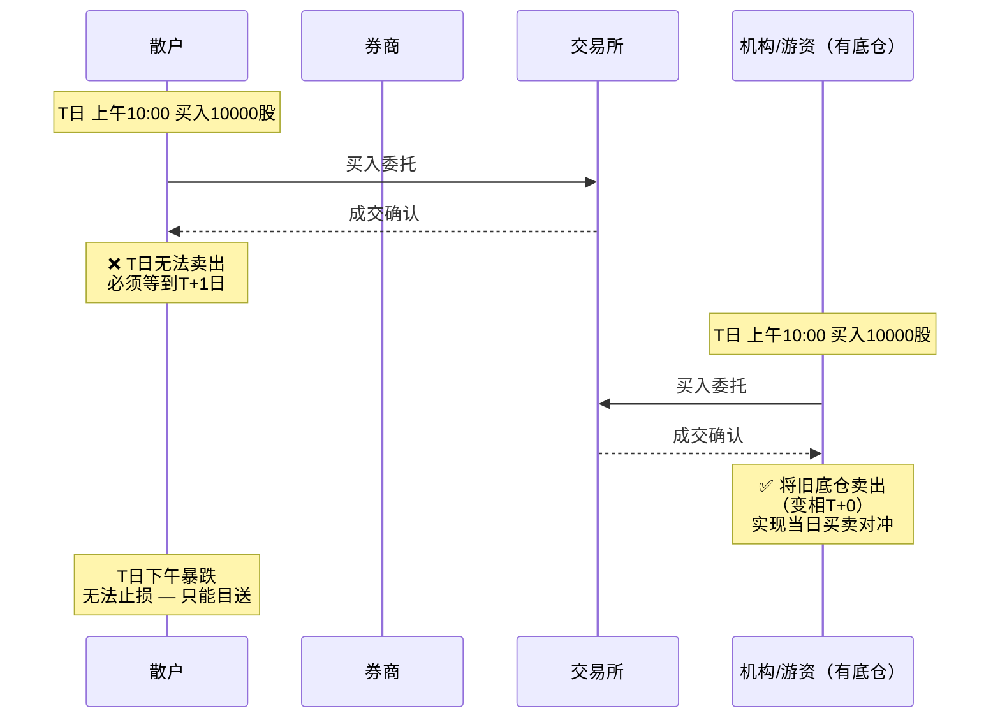
```mermaid
sequenceDiagram
    participant 散户
    participant 券商
    participant 交易所
    participant 机构/游资（有底仓）

    Note over 散户: T日 上午10:00 买入10000股
    散户->>交易所: 买入委托
    交易所-->>散户: 成交确认
    Note over 散户: ❌ T日无法卖出<br/>必须等到T+1日

    Note over 机构/游资（有底仓）: T日 上午10:00 买入10000股
    机构/游资（有底仓）->>交易所: 买入委托
    交易所-->>机构/游资（有底仓）: 成交确认
    Note over 机构/游资（有底仓）: ✅ 将旧底仓卖出<br/>（变相T+0）<br/>实现当日买卖对冲

    Note over 散户: T日下午暴跌<br/>无法止损 — 只能目送
```

**T+1的"保护错觉"**：

| 维度   | 设计初衷            | 实际效果                                 |
| ---- | --------------- | ------------------------------------ |
| 抑制投机 | 阻止当日频繁买卖，减少过度投机 | 散户确实无法频繁交易，但机构/游资通过底仓滚动做T+0          |
| 保护散户 | 防止散户当天追涨杀跌      | **在暴跌日，散户眼睁睁看着账户缩水却无法卖出止损**          |
| 维护稳定 | 减少日内波动          | T+1延迟了套利力量进场，反而导致**错误定价持续更久**，波动并未减小 |

> **关键判断**：T+1制度创造了\*\*"散户只有一条腿，部分参与者有两条腿"\*\*的不对称格局。拥有券源或底仓的机构/游资可以通过"先买后卖旧底仓"或融券"先卖后买"实现变相T+0，而占交易量70%+的散户被锁定24小时。

#### 涨跌停制度：中国的"冷却机制"

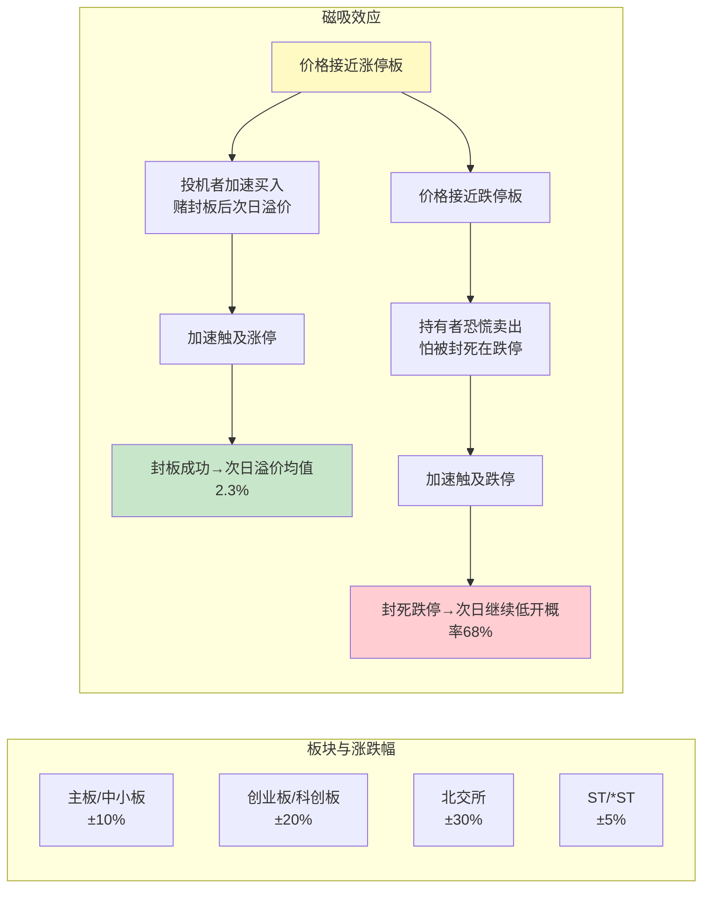
```mermaid
graph LR
    subgraph 板块与涨跌幅
        A["主板/中小板<br/>±10%"]
        B["创业板/科创板<br/>±20%"]
        C["北交所<br/>±30%"]
        D["ST/*ST<br/>±5%"]
    end

    subgraph 磁吸效应
        E["价格接近涨停板"] --> F["投机者加速买入<br/>赌封板后次日溢价"]
        F --> G["加速触及涨停"]
        G --> H["封板成功→次日溢价均值2.3%"]
        E --> I["价格接近跌停板"]
        I --> J["持有者恐慌卖出<br/>怕被封死在跌停"]
        J --> K["加速触及跌停"]
        K --> L["封死跌停→次日继续低开概率68%"]
    end

    style E fill:#fff9c4
    style H fill:#c8e6c9
    style L fill:#ffcdd2
```

**涨跌停制度下的"涨停板经济学"**：

| 现象        | 数据                 | 博弈逻辑                         |
| --------- | ------------------ | ---------------------------- |
| 涨停板次日开盘溢价 | 平均**2.3%**         | "打板"策略的盈利来源——抢在涨停前买入，次日高开卖出  |
| 涨停后5日回撤   | 超过**4%**           | 追板的散户往往在回撤中亏损——"打板一时爽，五天火葬场" |
| 连板股（N连板）  | 市场存在专门"数板"的资金      | 形成了独特的"龙头战法""情绪周期"等非基本面炒作文化  |
| 跌停板流动性    | 封死跌停时成交量近乎为零       | 最需要卖的时候反而卖不出去——"跌停板排队"       |
| 翘板成功率     | 跌停被"翘开"后次日上涨概率约40% | 专业资金在跌停板大量吃货"翘板"，散户割肉后筹码被收走  |

> **核心矛盾**：涨跌停制度本想抑制投机，却在A股催生了全球独有的"打板"投机文化——交易制度反过来塑造了交易行为。

### 2.4 深层制度性特征——六层"不对称"

```
A股的结构性不对称（每一层都使散户处于劣势）:

第1层：方向不对称
    ←→ 做多（所有人）+ 做空（仅有融券渠道，散户几乎用不到）
    → 天然的多头市场 → 泡沫容易膨胀，暴跌时没有反向力量缓冲

第2层：时间不对称
    T+1（散户）vs 变相T+0（机构/游资）
    → 散户持仓被锁定一天，机构可当日滚动套利

第3层：价格不对称
    涨跌停 vs 机构大宗交易折价买入
    → 机构以9折拿到筹码，散户在涨停板上追

第4层：信息不对称
    机构提前调研+卫星数据+产业链验证 vs 散户看公告
    → 财报公布前机构已布局/撤退完毕

第5层：速度不对称
    量化微秒级 vs 散户300ms+
    → 散户看到的行情已是300ms前的，"别人已经买完了你才看到"

第6层：成本不对称
    机构：印花税+极低佣金（万1以下）+算法交易降低冲击成本
    散户：印花税0.1%+较高佣金（万2.5-万3）+情绪化交易的巨大冲击成本
```

#### 量化交易的冲击——新维度的不对称

| 指标               | 数据          | 影响                |
| ---------------- | ----------- | ----------------- |
| 2025年Q1程序化交易占成交额 | **29%**     | 近三成交易由算法驱动        |
| 其中高频交易占比         | **60%**     | 大部分程序化交易是微秒/毫秒级别的 |
| 量化私募管理规模         | 超万亿         | 幻方、九坤、灵均、衍复等头部集中  |
| 散户信号延迟           | 至少**300毫秒** | 量化在此窗口内已完成价格发现和执行 |
| 利用T+1套利          | —           | 量化利用T+1下的锁定期做精准套利 |

> **最新监管动态**：2024年新规要求高频交易需报备，每秒300笔以上的"高频"被单独监管。但执行层面效果尚待观察。

#### 机构行为也短期化——"大散户"现象

| 指标            | 数据                          |
| ------------- | --------------------------- |
| 主动权益类基金平均持仓周期 | **1.8年**（vs 美股基金3-5年）       |
| 季度换手率（偏股基金）   | 约150-250%（即每季度换掉1/4到1/2的持仓） |
| 2021-2024连续三年 | 主动权益类基金**中位数收益跑输沪深300**     |
| 考核周期          | 多数公募实行季度排名+年度排名             |

> **讽刺之处**：机构在A股常被称为"大号散户"——面临同样的排名压力、同样的短期考核、同样的追涨杀跌，只不过资金量大、工具更多而已。真正的"长期资金"（社保、险资、养老金）占比极低。

#### A股退市与分红的结构性短板

| 指标     | A股                    | 成熟市场                   | 差序        |
| ------ | --------------------- | ---------------------- | --------- |
| 年均退市率  | **\~0.3%**（近年提升至\~1%） | 美股\~6.4%               | 退市太少      |
| 退市类型   | 强制退市为主（约88%）          | 主动退市为主（并购退市56%+私有化41%） | 市场化退市渠道缺位 |
| 分红率    | 34.1%                 | 港股45%、美股50%+           | 回馈股东偏弱    |
| IPO常态化 | 年均300-400家            | 与退市保持动态平衡              | "只进不出"    |

### 2.5 A股市场结构的"行为金融学"总结

```
┌─────────────────────────────────────────────────────────┐
│              A股市场生态的"飞轮效应"                       │
│                                                          │
│  散户占交易量70%+                                         │
│      ↓                                                   │
│  定价由情绪+动量驱动（非基本面驱动）                        │
│      ↓                                                   │
│  高波动+频繁换手+追涨杀跌                                  │
│      ↓                                                   │
│  散户系统性亏损（98%的10万以下账户亏损）                   │
│      ↓                                                   │
│  亏损后不退出，反而加仓/换股（"翻本"心态）                 │
│      ↓                                                   │
│  换手率更高，交易成本更高，亏损加速                         │
│      ↓                                                   │
│  "韭菜"生态自我循环 ← 制度不对称持续存在                    │
│                                                          │
│  破局方向：                                               │
│  → 扩大机构占比（养老金/险资/外资/ETF被动投资）             │
│  → T+0试点 + 丰富做空工具 → 弥补散户工具劣势               │
│  → 投顾/投教 + "买者自负"前提是"卖者有责"                   │
└─────────────────────────────────────────────────────────┘
```

***

## 3. A股定价的底层逻辑

### 3.1 三维核心定价框架——DCF模型的A股表达

A股的定价逻辑可由DCF（现金流贴现）模型的三个关键变量拆解。但与成熟市场不同，A股中这三个变量的**驱动因素和权重**有其独特规律：

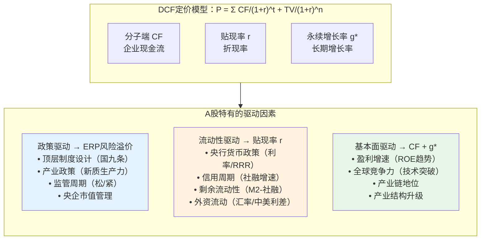
```mermaid
graph TB
    subgraph DCF["DCF定价模型：P = Σ CF/(1+r)^t + TV/(1+r)^n"]
        direction TB
        CF["分子端 CF<br/>企业现金流"]
        r["贴现率 r<br/>折现率"]
        g["永续增长率 g*<br/>长期增长率"]
    end

    subgraph A股驱动["A股特有的驱动因素"]
        direction TB
        P1["政策驱动 → ERP风险溢价<br/>• 顶层制度设计（国九条）<br/>• 产业政策（新质生产力）<br/>• 监管周期（松/紧）<br/>• 央企市值管理"]
        P2["流动性驱动 → 贴现率 r<br/>• 央行货币政策（利率/RRR）<br/>• 信用周期（社融增速）<br/>• 剩余流动性（M2-社融）<br/>• 外资流动（汇率/中美利差）"]
        P3["基本面驱动 → CF + g*<br/>• 盈利增速（ROE趋势）<br/>• 全球竞争力（技术突破）<br/>• 产业链地位<br/>• 产业结构升级"]
    end

    DCF --> A股驱动

    style P1 fill:#e3f2fd
    style P2 fill:#fff3e0
    style P3 fill:#e8f5e9
```

**三维度的权重在不同市场阶段截然不同**：

| 市场阶段     | 政策(ERP)权重 | 流动性(r)权重 | 基本面(g\*)权重 | 典型案例                   |
| -------- | :-------: | :------: | :--------: | ---------------------- |
| **熊市末期** |   ⭐⭐⭐⭐⭐   |    ⭐⭐⭐   |      ⭐     | 2024年2月2635点——政策托底是关键  |
| **牛市初期** |    ⭐⭐⭐⭐   |   ⭐⭐⭐⭐   |     ⭐⭐     | 2024年9月——政策+降准降息共振     |
| **牛市中期** |     ⭐⭐    |   ⭐⭐⭐⭐⭐  |     ⭐⭐⭐    | 2014-2015——流动性泛滥主导     |
| **牛市末期** |     ⭐     |    ⭐⭐    |    ⭐⭐⭐⭐⭐   | 2007年6124——基本面"故事"支撑泡沫 |
| **震荡市**  |    ⭐⭐⭐    |    ⭐⭐⭐   |     ⭐⭐⭐    | 2016-2017——三维均衡        |

### 3.2 维度一：政策驱动——A股最独特的定价因子

> **核心命题**：在A股，政策的边际变化直接改变市场对**长期确定性的定价**（即风险溢价ERP），其影响力远超当期盈利变化。

#### 政策如何影响ERP？——传导机制

```
政策信号 → 改变长期确定性预期 → ERP上升/下降 → 估值中枢移动

正例（ERP下降，估值上移）：
  科创板设立(2019) → "科技自立"有了制度保障 → 半导体估值体系重塑
  央企市值管理(2024) → 央企治理改善预期 → 中字头PB修复（0.5→0.8+）
  第三个国九条(2024) → "投资市"定位 → 中长期资金愿意给更高估值

反例（ERP上升，估值下移）：
  2021年"防止资本无序扩张" → 互联网/教育/地产不确定性飙升 → 暴跌
  2018年去杠杆+贸易战 → 经济增长不确定性 → 全年跌25%
  2015年清理配资 → 市场制度不确定性 → 千股跌停踩踏
```

#### 2015-2022年间重大政策调整的频率

| 年份   | 重大政策调整次数（估）                | 市场年度涨跌幅      |
| ---- | -------------------------- | ------------ |
| 2015 | \~15次（配资清理+救市+熔断准备）        | +9.4%（但年内巨震） |
| 2016 | \~10次（熔断+叫停熔断+险资监管）        | -12.3%       |
| 2017 | \~5次（减持新规+再融资收紧）           | +6.6%        |
| 2018 | \~12次（去杠杆+贸易战应对+民企纾困）      | -24.6%       |
| 2019 | \~8次（科创板开市+注册制+LPR改革）      | +22.3%       |
| 2020 | \~10次（抗疫宽松+新证券法+退市新规）      | +13.9%       |
| 2021 | \~12次（反垄断+教培双减+地产三条红线+北交所） | +4.8%        |
| 2022 | \~10次（中特估提出+金融稳定法+防疫优化）    | -15.1%       |

> 年均约**12次**重大政策调整——远高于美股（约3-4次/年）。这种"政策密度"是A股高波动的重要来源。

### 3.3 维度二：流动性驱动——A股的"水龙头"

> **核心命题**：A股的短期（1-2年）估值波动几乎完全由流动性周期驱动。在A股，"放水"≈"涨"，"收水"≈"跌"，这一规律比美股更直接、更强。

#### 流动性对A股估值的传导——"剩余流动性"框架

```
剩余流动性 = M2增速 - 社会融资规模增速

当剩余流动性↑（M2增速 > 社融增速）：
  实体信贷需求弱 + 货币宽松 → "钱多但无处可去" → 涌入金融市场
  → 对利率敏感的成长股/小盘股跑赢
  → A股历史上每一次大行情都伴随着剩余流动性扩张

当剩余流动性↓（M2增速 < 社融增速）：
  实体信贷需求旺盛 + 货币收紧 → "钱去了实体经济"
  → 股市资金被抽走 → 整体承压，仅剩结构性机会
```

#### A股关键行情时期的流动性组合复盘

| 时期        | 剩余流动性状态          | 利率方向 | 上证表现         |
| --------- | ---------------- | ---- | ------------ |
| 2005-2007 | 宽货币+宽信用（双宽）      | 先下后上 | +514%        |
| 2008      | 宽货币+紧信用          | 急剧下行 | -65.4%       |
| 2009      | 极度宽货币+宽信用（四万亿）   | 急剧下行 | +80%         |
| 2014-2015 | 宽货币+弱信用（剩余流动性暴增） | 持续下行 | +160%        |
| 2016-2017 | 中性货币+信用修复        | 温和上行 | +6.6%（结构分化）  |
| 2018      | 紧货币+紧信用（去杠杆）     | 上行   | -24.6%       |
| 2020      | 宽松对冲疫情           | 急剧下行 | +13.9%       |
| 2021      | 中性偏松（社融回落）       | 下行   | +4.8%（估值贡献负） |
| 2022-2023 | 宽松但信用传导不畅        | 下行   | -15.1%/-3.7% |
| 2024      | 持续宽松+社融修复        | 持续下行 | 政策底明确        |

> **规律总结**：社融增速回升 + 利率下行的"类复苏"组合，是A股最理想的流动性环境。这一组合在2024年Q4再次出现。

#### "从海外定价到国内定价"的切换

```
2021-2023年：海外定价主导
  中美利差倒挂 → 外资流出 → A股受美债利率攀升高压
  → 即使国内降息，估值也难以扩张
  → "美债利率是A股的隐形天花板"

2024年起：国内定价切换
  美债利率仍高，但国内降息力度更大且社融修复
  → 外资流出压力减轻，国内资金成边际定价主力
  → 估值修复由国内利率下行驱动，而非美债
  → "内外定价权重正在发生历史性切换"
```

### 3.4 维度三：基本面驱动——从"当期盈利"到"永续增长预期"

> **核心命题**：A股对"远期故事"的定价权重远超当期盈利——牛市顶部往往以极度乐观的g*预期为支撑，熊市底部则以g*崩溃为特征。

#### 基本面定价的"两步走"框架

```
阶段一：先涨估值（预期驱动）
  "我预期未来盈利会好" → g*预期上升 → 估值扩张
  即使当期EPS还没动，PE已经从10倍涨到20倍
  → 牛市初期的典型特征

阶段二：再涨盈利（现实验证）
  盈利确实兑现了 → EPS上升 → 即使PE不再扩张甚至收缩
  股价的上涨由盈利增长接棒
  → 牛市中后期的典型特征

阶段三：戴维斯双杀（崩溃）
  盈利不及预期 + g*预期崩塌 → PE和EPS同时收缩
  → 熊市的典型特征
```

#### A股对各行业的"g\*溢价"差异

| 行业/赛道      | g\*定价权重 | 当期EPS权重 | 典型PE区间  | 定价叙事            |
| ---------- | :-----: | :-----: | ------- | --------------- |
| **AI/半导体** |    极高   |    极低   | 50-200倍 | "国产替代空间万亿"      |
| **新能源**    |    高    |    低    | 20-60倍  | "全球能源转型不可逆"     |
| **消费品牌**   |    中高   |    中    | 20-40倍  | "消费升级长期趋势"      |
| **银行**     |    极低   |    极高   | 4-8倍    | "没有增长故事，只看当期利差" |
| **建筑/基建**  |    低    |    高    | 5-12倍   | "项目制，无永续性可言"    |
| **煤炭/资源**  |    低    |    中高   | 6-15倍   | "周期性，不可线性外推"    |

> **核心发现**：银行PE仅4-8倍不是"低估"，而是**g\*≈0甚至为负**的合理定价——在利率长期下行+金融脱媒+坏账不确定的背景下，银行没有"永续增长故事"可讲。这也是"中特估"试图解决的问题：通过改变治理结构和考核方式，给国企一个g\*预期。

### 3.5 定价叙事的范式转换——从"增长叙事"到"竞争力叙事"

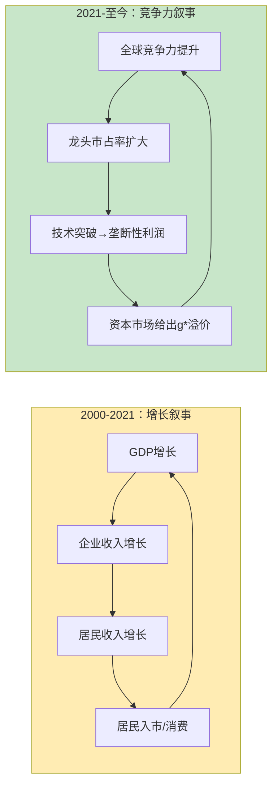
```mermaid
graph LR
    subgraph 旧叙事["2000-2021：增长叙事"]
        O1["GDP增长"] --> O2["企业收入增长"]
        O2 --> O3["居民收入增长"]
        O3 --> O4["居民入市/消费"]
        O4 --> O1
    end

    subgraph 新叙事["2021-至今：竞争力叙事"]
        N1["全球竞争力提升"] --> N2["龙头市占率扩大"]
        N2 --> N3["技术突破→垄断性利润"]
        N3 --> N4["资本市场给出g*溢价"]
        N4 --> N1
    end

    style 旧叙事 fill:#ffecb3
    style 新叙事 fill:#c8e6c9
```

**李迅雷（中泰证券）的三层"虚实背离"论**：

| 背离层次    | 具体内容                              | 对定价的影响               |
| ------- | --------------------------------- | -------------------- |
| **第一层** | 前10%公司贡献A股市值60-70%，其盈利与居民收入增速相关性弱 | 盯着居民消费数据判断A股已不充分     |
| **第二层** | 市场不再看GDP增速，而是看全球竞争胜率              | 宏观经济数据对股市的指示意义弱化     |
| **第三层** | 企业端与居民端从"同步"走向"分化"                | 上市公司利润可以增长，但居民体感可能很差 |

> **结论**：这一范式转换意味着——**用GDP增速、居民收入、消费数据等传统宏观指标判断A股将越来越不准确**，而需要更多地关注中国龙头企业的全球市占率、技术突破进展和产业链地位变化。

### 3.6 "中国特色估值体系"（中特估）——系统性的估值纠偏

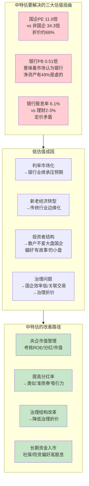
```mermaid
graph TB
    subgraph 问题["中特估要解决的三大估值扭曲"]
        Q1["国企PE 11.0倍<br/>vs 非国企 34.3倍<br/>折价约68%"]
        Q2["银行PB 0.51倍<br/>意味着市场认为银行<br/>净资产有49%是虚的"]
        Q3["银行股息率 6.1%<br/>vs 理财2-3%<br/>定价矛盾"]
    end

    subgraph 成因["低估值成因"]
        C1["利率市场化<br/>→银行业绩承压预期"]
        C2["新老经济转型<br/>→传统行业边缘化"]
        C3["投资者结构<br/>→散户不爱大盘国企<br/>偏好'有故事'的小盘"]
        C4["治理问题<br/>→国企效率低/关联交易<br/>→治理折价"]
    end

    subgraph 方案["中特估的改善路径"]
        S1["央企市值管理<br/>考核ROE/分红/市值"]
        S2["提高分红率<br/>→类似'准债券'吸引力"]
        S3["治理结构改革<br/>→降低治理折价"]
        S4["长期资金入市<br/>社保/险资偏好高股息"]
    end

    问题 --> 成因
    成因 --> 方案

    style Q1 fill:#ffcdd2
    style Q2 fill:#ffcdd2
    style Q3 fill:#ffcdd2
    style S1 fill:#c8e6c9
    style S2 fill:#c8e6c9
    style S3 fill:#c8e6c9
    style S4 fill:#c8e6c9
```

**中特估的量化目标（基于第三个国九条精神推算）**：

| 指标    | 当前水平  | 合理目标     | 所需变化     |
| ----- | ----- | -------- | -------- |
| 国企PE  | 11.0倍 | 15-18倍   | 提36-64%  |
| 银行PB  | 0.51倍 | 0.8-1.0倍 | 提57-96%  |
| 国企分红率 | \~35% | 40-50%   | 接近港股蓝筹水平 |
| 央企ROE | \~10% | 12-15%   | 效率改善     |

> **关键判断**：中特估不是"炒作概念"，而是试图从根本上修复A股最大的估值扭曲——国企相对于非国企约68%的折价。这一修复需要治理改善、分红提升和长期资金入市三管齐下，可能需要5-10年的周期。

### 3.7 "双重重估"框架——中国资产的重定价逻辑（中国银河证券）

```
第一重重估：增长重估（从折价到溢价）
  过去：基于"中国增长不可持续"的担忧 → 给中国资产打折扣
  现在：新质生产力接棒土地财政 → 三新经济占GDP比重攀升
  标志事件：宁德时代市值超茅台
  → 资本市场的市值龙头从白酒变为新能源 → 定价权由"老经济"转向"新经济"

第二重重估：风险重估（从折价到安全溢价）
  过去：新兴市场风险溢价 → 给中国资产打折扣
  现在：产业链完整性+政策自主性+抗风险空间 → "安全溢价"
  → 在全球地缘政治动荡中，中国资产的稳定性反而成了稀缺品
```

### 3.8 A股定价逻辑的总结框架

```
┌────────────────────────────────────────────────────────┐
│         A股定价 = f(政策·ERP, 流动性·r, 竞争力·g*)      │
│                                                         │
│  短期（1年内）：                                        │
│    政策 > 流动性 > 基本面                               │
│    政策信号变化 → ERP跳变 → 剧烈但短暂的估值波动         │
│                                                         │
│  中期（1-3年）：                                        │
│    流动性 > 政策 > 基本面                               │
│    信用周期/剩余流动性决定估值的方向和幅度               │
│                                                         │
│  长期（3年以上）：                                      │
│    基本面 > 政策 > 流动性                               │
│    g*（永续增长预期）是终极定价锚                       │
│    但基本面的定义已从"GDP增长"切换为"全球竞争力"          │
│                                                         │
│  风险因子（可能导致ERP非线性跳升）：                     │
│    中美关系恶化 / 关键技术脱钩 / 资产负债表衰退 /        │
│    全球秩序重构 / 预期之外的政策收紧                     │
└────────────────────────────────────────────────────────┘
```

***

## 4. A股与成熟市场的核心差异

### 4.1 三大市场全景对比

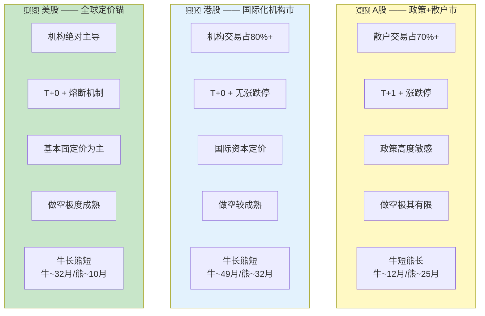
```mermaid
graph TB
    subgraph A股["🇨🇳 A股 —— 政策+散户市"]
        A1["散户交易占70%+"]
        A2["T+1 + 涨跌停"]
        A3["政策高度敏感"]
        A4["做空极其有限"]
        A5["牛短熊长<br/>牛~12月/熊~25月"]
    end
    subgraph 港股["🇭🇰 港股 —— 国际化机构市"]
        H1["机构交易占80%+"]
        H2["T+0 + 无涨跌停"]
        H3["国际资本定价"]
        H4["做空较成熟"]
        H5["牛长熊短<br/>牛~49月/熊~32月"]
    end
    subgraph 美股["🇺🇸 美股 —— 全球定价锚"]
        U1["机构绝对主导"]
        U2["T+0 + 熔断机制"]
        U3["基本面定价为主"]
        U4["做空极度成熟"]
        U5["牛长熊短<br/>牛~32月/熊~10月"]
    end

    style A股 fill:#fff9c4
    style 港股 fill:#e3f2fd
    style 美股 fill:#c8e6c9
```

### 4.2 市场基础与规模

| 维度         | A股                | 港股                | 美股                |
| ---------- | ----------------- | ----------------- | ----------------- |
| **成立时间**   | 1990年（35年）        | 1891年（135年）       | 1792年（234年）       |
| **交易场所**   | 上交所+深交所+北交所       | 香港联交所             | NYSE+NASDAQ+AMEX  |
| **交易货币**   | 人民币（CNY）          | 港币（HKD）           | 美元（USD）           |
| **上市公司数**  | 超5,300家           | 约2,300家（主板）       | 约5,500家（含OTC则超万家） |
| **总市值（约）** | 85-90万亿元（约12万亿美元） | 约35万亿港元（约4.5万亿美元） | 约50万亿美元           |
| **日均成交额**  | 约8,000亿-1.5万亿人民币  | 约800-1,500亿港元     | 约3,000-5,000亿美元   |
| **全球市值占比** | 约10-12%           | 约4-5%             | 约40-45%           |
| **成立年限**   | 35年（"青年"市场）       | 135年              | 234年              |

### 4.3 交易机制深度对比

| 对比维度           | A股                   | 港股              | 美股                            | 关键影响               |
| -------------- | -------------------- | --------------- | ----------------------------- | ------------------ |
| **交易制度**       | **T+1**              | T+0             | T+0                           | A股散户无法当日止损         |
| **结算制度**       | T+1                  | T+2             | T+2（2024年缩短）                  | 资金效率               |
| **涨跌幅限制**      | 主板±10%/科创±20%/北交±30% | **无限制**（VCM冷静期） | **无限制**（熔断机制）                 | A股抑制了波动但也制造了"打板"文化 |
| **最小交易单位**     | 100股                 | 由公司自定（不定）       | **1股**                        | 美股对小资金最友好          |
| **做空机制**       | 有限融券（标的有限+券源垄断）      | 做空较成熟           | **极度成熟**                      | A股"只能做多"基因         |
| **盘前/盘后交易**    | 集合竞价9:15-9:25        | 盘前9:00-9:30     | **盘前4:00-9:30+盘后16:00-20:00** | 美股可全天候调整头寸         |
| **交易时间(北京时间)** | 9:30-15:00           | 9:30-16:00      | 21:30-04:00(夏令)               | 中国投资者交易美股需熬夜       |

#### A股T+1 vs 港股/美股 T+0：制度差异的深远影响

```
T+1环境下（A股）：
  买入 → 锁定24小时 → 次日才能卖出
  → 短线资金不敢大仓位过夜（怕突发利空）
  → 盘中追涨资金被"套牢一天"
  → 恐慌性抛售集中在午后（"下午两点半跳水"现象）

T+0环境下（港股/美股）：
  买入 → 可即时卖出
  → 日内交易者可随时调整
  → 错误定价可被当日纠正（套利力量即时进场）
  → 不存在"被锁一天"的流动性黑洞
```

#### 三地熔断/冷静期机制对比

| 机制       |        A股（已废止）       |     港股（VCM冷静期）     | 美股（Circuit Breaker） |
| -------- | :------------------: | :----------------: | :-----------------: |
| **触发阈值** |     5%/7%（沪深300）     |    参考价的±10%-±20%   |  7%/13%/20%（标普500）  |
| **暂停时间** |       15分钟→全天停止      | **5分钟冷静期**（仅限触发证券） |      15分钟→全天停止      |
| **适用范围** |          全市场         |    仅恒指/国企/恒科成分股    |         全市场         |
| **存活时间** | **4天（2016.1.4-1.7）** |       2016年至今      |    1988年至今（经多次修订）   |
| **设计逻辑** |      照搬美股但大幅降低阈值     |   参考价上下一定比例触发冷静期   |      全市场熔断+个股暂停     |

> **熔断在中国失败的根本原因**：美股T+0+无涨跌停的市场中，熔断是"最后一道防线"；中国T+1+涨跌停本已是两道"锁"，再加熔断等于上了第三把锁——流动性被彻底锁死，恐慌变成了绝望。

### 4.4 上市制度与市场"新陈代谢"对比

| 维度             | A股                         | 港股                     | 美股                 | A股的优势/劣势          |
| -------------- | -------------------------- | ---------------------- | ------------------ | ----------------- |
| **审核制度**       | 注册制（2023全面）                | 注册制（双重存档）              | 注册制（披露即原则）         | ✅ 已完成从核准制到注册制的转变  |
| **审核周期**       | 平均约745天（含辅导期）              | 平均约307天                | 平均约404天            | ❌ 周期最长、监管最繁琐      |
| **盈利要求**       | 主板最严（3年连续盈利+净利>2亿）；科创板可未盈利 | 允许未盈利（18A生物科技/18C特专科技） | 无盈利要求（多套标准）        | ❌ 硬科技/未盈利企业上市路径仍窄 |
| **VIE架构**      | 不接受                        | 有条件接受                  | 普遍接受               | ❌ 互联网企业只能去境外上市    |
| **WVR（同股不同权）** | 有限接受（仅科创板，市值≥100亿或收入≥5亿）   | 接受（2018年起，加-W标识）       | 普遍接受               | ❌ 创新企业治理架构受限      |
| **行业限制**       | "红黄灯"窗口指导（学科培训禁止、白酒限制等）    | 无明显行业限制                | 无明显行业限制            | ❌ 政策窗口指导影响上市预期    |
| **上市途径**       | 传统IPO为主                    | IPO+介绍+二次上市+SPAC       | IPO+直接挂牌+SPAC+反向并购 | ❌ 路径最单一           |

#### "新陈代谢"能力——退市率的巨大差距

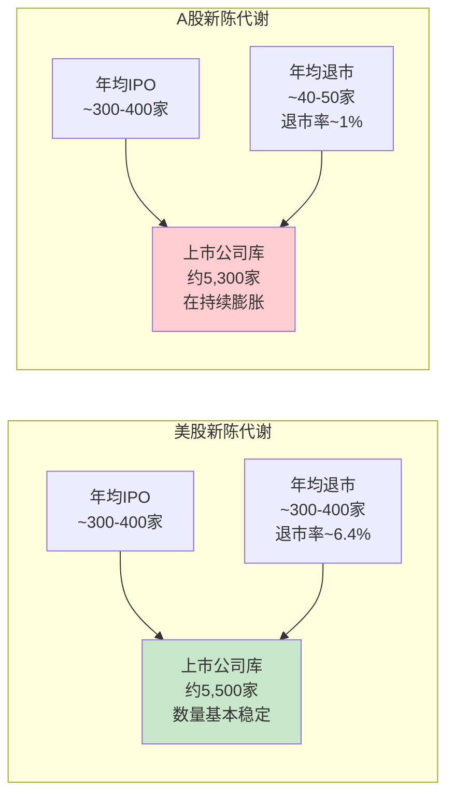
```mermaid
graph LR
    subgraph 美股新陈代谢
        M1["年均IPO<br/>~300-400家"] --> M2["上市公司库<br/>约5,500家<br/>数量基本稳定"]
        M3["年均退市<br/>~300-400家<br/>退市率~6.4%"] --> M2
    end

    subgraph A股新陈代谢
        A1["年均IPO<br/>~300-400家"] --> A2["上市公司库<br/>约5,300家<br/>在持续膨胀"]
        A3["年均退市<br/>~40-50家<br/>退市率~1%"] --> A2
    end

    style M2 fill:#c8e6c9
    style A2 fill:#ffcdd2
```

| 退市维度         | A股                     | 港股      | 美股                               |
| ------------ | ---------------------- | ------- | -------------------------------- |
| **年均退市率**    | <1%（近年提升中）             | \~1.56% | \~9.3%                           |
| **退市主要方式**   | **强制退市为主（88%）**        | 强制+私有化  | **主动退市为主（并购56%+私有化41%，强制仅2.5%）** |
| **退市后渠道**    | 老三板（流动性极差）             | 缺乏场外市场  | **OTC市场**（活跃）                    |
| **退市再上市**    | 可申请"重新上市"（后门）          | —       | 重新IPO                            |
| **"十四五"退市数** | 186家（较"十三五"增5倍）        | —       | 同期约1500-2000家                    |
| **存量"僵尸企业"** | 估计500-800家（市值<10亿、无主营） | 相对较少    | 持续出清                             |

> **中美退市率相差约20倍**。这意味着A股就像一个"只进不出"的蓄水池，优质公司被稀释。这是第三个国九条将退市列为核心议题的根本原因。

### 4.5 投资者结构 → 市场行为差异

| 维度           | A股                   | 港股       | 美股            |
| ------------ | -------------------- | -------- | ------------- |
| **散户交易占比**   | **70%+**             | \~20%    | \~10-15%      |
| **机构持股占比**   | \~20%（含一般法人则\~60%）   | \~60%    | \~55%         |
| **外资持股占比**   | \~4-5%               | \~36%    | \~15-20%      |
| **养老金/长线资金** | 占市值约8%               | 占市值约15%  | 占市值约35%       |
| **年金化程度**    | 极低                   | 中等       | 高（401k+IRA体系） |
| **平均持股周期**   | \~30天（散户）/\~1.8年（机构） | \~1-3年   | \~3-5年+       |
| **换手率**      | \~250-400%（全市场年均）    | \~50-80% | \~100-130%    |

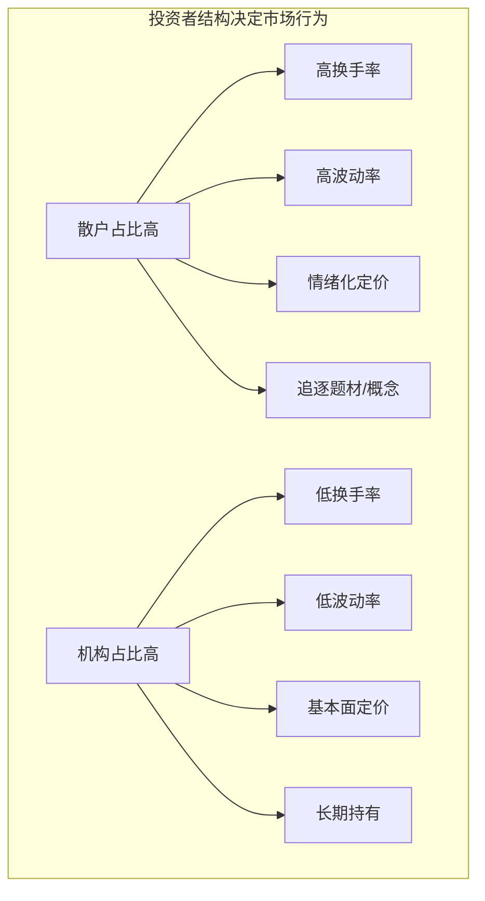
```mermaid
graph TB
    subgraph 投资者结构决定市场行为
        direction LR
        I1["散户占比高"] --> B1["高换手率"]
        I1 --> B2["高波动率"]
        I1 --> B3["情绪化定价"]
        I1 --> B4["追逐题材/概念"]

        I5["机构占比高"] --> B5["低换手率"]
        I5 --> B6["低波动率"]
        I5 --> B7["基本面定价"]
        I5 --> B8["长期持有"]
    end
```

### 4.6 牛熊周期规律对比

| 市场     | 牛市特征                  | 熊市特征                  |  牛熊比  |
| ------ | --------------------- | --------------------- | :---: |
| **A股** | 牛短熊长：平均**12个月**，涨幅可翻倍 | 平均**25.5个月**，跌幅40-70% | 1:2.1 |
| **港股** | 牛长熊短：平均**49个月**       | 平均**32个月**            | 1.5:1 |
| **美股** | 牛长熊短：平均**32个月**，涨幅可翻倍 | 平均**10个月**，跌幅约三成      | 3.2:1 |

```
A股典型牛熊周期示意图（以2005-2024为例）:

2005        2007       2008          2014-15     2016      2018      2019-20   2021-23  2024
 |---大牛---|--大熊--|-----震荡-----|---牛--|-熊/震荡-|--小熊--|--反弹--|--熊---|--反弹-|
 998→6124  6124→1664  1664→3478→1849  1849→5178 5178→2638 3587→2440 2440→3731 3731→2635 2635→?
 (+514%)   (-73%)    (5年震荡)        (+180%)  (-30%)   (-32%)  (+53%)   (-30%)  ...
```

### 4.7 三地市场的套利与互补关系

```
AH溢价指数：衡量同一公司A股相对H股的溢价程度

历史区间：85-213（平均值约120-130）
当前水平（2025估）：约130-140（即A股比H股平均贵30-40%）

原因：
1. A股散户偏好弹性小盘 → 流动性溢价
2. H股外资主导 → 更看重基本面 → 估值更理性
3. 资本管制 → 套利不能充分进行 → 溢价长期存在
4. 红利税差异：H股股息税20%（内地投资者通过港股通），A股持有一年以上免税

投资含义：
→ 当AH溢价指数>140：H股相对更便宜，南下资金加速
→ 当AH溢价指数<115：A股相对更便宜，北上资金加速
→ 同一公司，追求分红回报买H股，追求价格弹性买A股
```

### 4.8 一句话差异总结 + 投资含义

| 市场     | 基因                     | 适合什么类型的投资        |
| ------ | ---------------------- | ---------------- |
| **A股** | 政策+散户市，价格弹性最大，错误定价机会最多 | 逆向投资、政策套利、成长挖掘   |
| **港股** | 国际化机构市，定价最理性，流动性两极分化严重 | 深度价值、高股息、耐心持有    |
| **美股** | 全球定价锚，制度最成熟，创新企业最集中    | 长期持有、指数投资、全球配置底仓 |

> **三者互补**：A股提供**成长弹性**（新质生产力），港股提供**深度价值**（高股息蓝筹），美股提供**全球创新敞口**（科技龙头）。理解三者的差异，是做好全球资产配置的前提。

***

## 5. 理解A股运行规律的关键框架

### 5.1 核心传导链：政策底 → 信用底 → 市场底 → 盈利底

这是中国A股主流投研机构最核心的分析框架。它不是"投资建议"，而是对A股运行规律的经验总结。

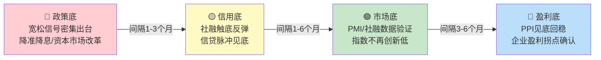
```mermaid
graph LR
    A["🔴 政策底<br/>宽松信号密集出台<br/>降准降息/资本市场改革"] -->|"间隔1-3个月"| B["🟡 信用底<br/>社融触底反弹<br/>信贷脉冲见底"]
    B -->|"间隔1-6个月"| C["🟢 市场底<br/>PMI/社融数据验证<br/>指数不再创新低"]
    C -->|"间隔3-6个月"| D["🔵 盈利底<br/>PPI见底回稳<br/>企业盈利拐点确认"]

    style A fill:#ffcdd2
    style B fill:#fff9c4
    style C fill:#c8e6c9
    style D fill:#bbdefb
```

#### 历史三轮经典案例复盘

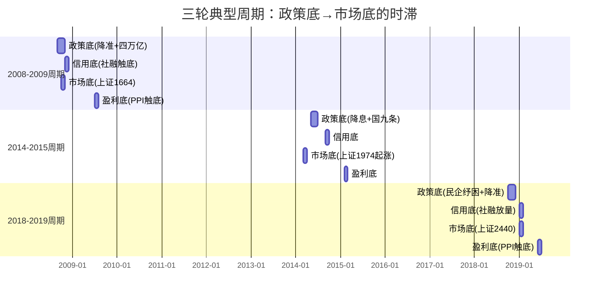
```mermaid
gantt
    title 三轮典型周期：政策底→市场底的时滞
    dateFormat YYYY-MM
    axisFormat %Y-%m

    section 2008-2009周期
    政策底(降准+四万亿)     :2008-09, 2M
    信用底(社融触底)        :2008-11, 1M
    市场底(上证1664)        :2008-10, 1M
    盈利底(PPI触底)         :2009-07, 1M

    section 2014-2015周期
    政策底(降息+国九条)     :2014-05, 2M
    信用底                   :2014-09, 1M
    市场底(上证1974起涨)     :2014-03, 1M
    盈利底                   :2015-02, 1M

    section 2018-2019周期
    政策底(民企纾困+降准)   :2018-10, 2M
    信用底(社融放量)         :2019-01, 1M
    市场底(上证2440)         :2019-01, 1M
    盈利底(PPI触底)          :2019-06, 1M
```

| 周期        | 政策底时间                          | 市场底时间                        |      时滞（月）      | 政策底到市场底跌幅 | 市场底后1年涨幅 |
| --------- | ------------------------------ | ---------------------------- | :-------------: | --------- | -------- |
| 2008-2009 | 2008年9月（降准降息+四万亿）              | 2008年10月（上证1664）             |    **\~1个月**    | 约-25%     | +101%    |
| 2014-2015 | 2014年5月（国九条+降息周期开启）            | 2014年3月（上证1974，几乎同步）         | **-1个月**（市场底略早） | 0%        | +160%    |
| 2018-2019 | 2018年10月（民企座谈会+纾困）             | 2019年1月（上证2440）              |    **\~3个月**    | 约-7%      | +39%     |
| 2024      | 2024年4月（第三国九条）+ 2024年9月（一揽子政策） | 2024年2月（2635）/ 2024年9月（二次确认） |    **先于政策底**    | —         | 待观察      |

> **华鑫证券的结论**：利好政策是"量变"，PMI/社融等数据的验证才是走出悲观行情的"质变"。政策底到市场底的时滞通常为1-3个月，但2024年出现了"市场底早于政策底"的新现象——中央汇金通过ETF持续买入改变了底部确认的节奏。

#### 当前周期位置判断（2024-2025）

```
2024-2025年的周期定位：

政策底：✅ 已确认（2024年4月国九条 + 9月一揽子超预期政策）
信用底：✅ 初步确认（2024Q4社融增速小幅回升）
市场底：✅ 已确认（2024年2月2635点为"救市底"，9月二次探底确认）
盈利底：⚠️ 待验证（PPI仍弱，但部分行业已出现盈利拐点萌芽）

当前状态：市场底→盈利底的过渡阶段
典型特征：宽幅震荡，结构性分化，等待盈利数据的"质变"信号
```

### 5.2 信用周期投资时钟——最实用的中期择时工具

以\*\*社融增速（量）+ 国债利率（价）\*\*两轴构建四象限轮动模型：

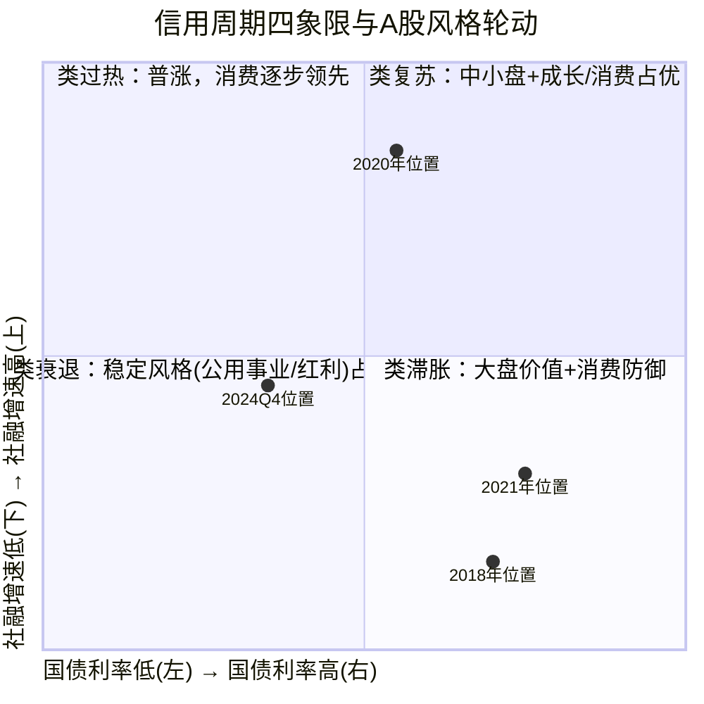
```mermaid
quadrantChart
    title 信用周期四象限与A股风格轮动
    x-axis "国债利率低(左) → 国债利率高(右)"
    y-axis "社融增速低(下) → 社融增速高(上)"
    quadrant-1 "类复苏：中小盘+成长/消费占优"
    quadrant-2 "类过热：普涨，消费逐步领先"
    quadrant-3 "类衰退：稳定风格(公用事业/红利)占优"
    quadrant-4 "类滞胀：大盘价值+消费防御"
    "2024Q4位置": [0.35, 0.45]
    "2021年位置": [0.75, 0.3]
    "2020年位置": [0.55, 0.85]
    "2018年位置": [0.7, 0.15]
```

| 象限         | 社融增速 | 国债利率 | 经济含义      | A股风格特征           | 代表时段             |
| ---------- | :--: | :--: | --------- | ---------------- | ---------------- |
| **类复苏** 🔵 | ↑ 走高 | ↓ 走低 | 政策宽松+信用启动 | 中小盘>大盘；成长/消费>价值  | 2024Q4、2019H1    |
| **类过热** 🟡 | ↑ 走高 | ↑ 走高 | 经济全面升温    | 普涨格局；消费逐步领先成长    | 2016-2017、2020H2 |
| **类滞胀** 🟠 | ↓ 走低 | ↑ 走高 | 信用收紧+物价压力 | 大盘价值+消费防御        | 2021H2-2022H1    |
| **类衰退** 🔴 | ↓ 走低 | ↓ 走低 | 经济下行+宽货币  | 稳定风格（公用/红利）；避险为王 | 2022H2-2023      |

#### 鹏华基金的"货币-信用-增长"三元升级框架

```
在原二维框架基础上增加"增长"维度，形成八个象限：

宽货币+紧信用+弱增长 → 价值、质量、低波、红利因子最优
宽货币+宽信用+强增长 → 成长、动量因子最优
紧货币+紧信用+弱增长 → 全面防御，现金为王
紧货币+宽信用+强增长 → 周期、价值占优
...
```

> **当前应用**（2025年）：A股处于"宽货币+信用由紧转松+弱增长修复中"的过渡阶段。这一阶段红利资产（高股息）仍是底仓，但成长股（新质生产力）的配置价值随信用修复而逐步上升。

### 5.3 产业周期——朱格拉周期决定中长期超额收益

> **核心命题**：信用周期决定了"什么时候买"，产业周期决定了"买什么"。找到朱格拉周期上升期行业，是在A股获得中长期超额收益的关键。

#### 三大经济周期的层级关系

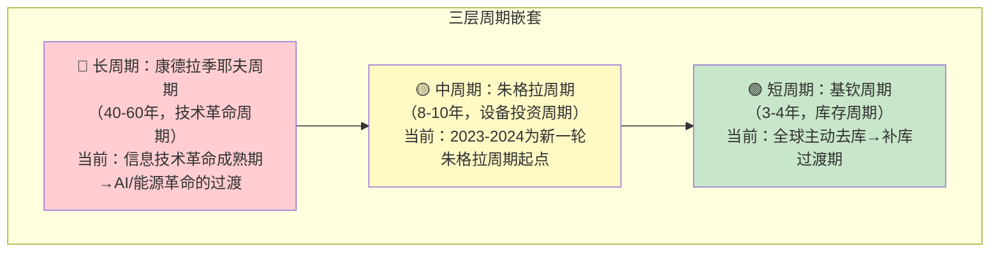
```mermaid
graph TB
    subgraph 三层周期嵌套
        L1["🔴 长周期：康德拉季耶夫周期<br/>（40-60年，技术革命周期）<br/>当前：信息技术革命成熟期→AI/能源革命的过渡"]
        L2["🟡 中周期：朱格拉周期<br/>（8-10年，设备投资周期）<br/>当前：2023-2024为新一轮朱格拉周期起点"]
        L3["🟢 短周期：基钦周期<br/>（3-4年，库存周期）<br/>当前：全球主动去库→补库过渡期"]
    end

    L1 --> L2 --> L3

    style L1 fill:#ffcdd2
    style L2 fill:#fff9c4
    style L3 fill:#c8e6c9
```

**朱格拉周期（设备投资周期）的核心逻辑**：

1. 经济存在约8-10年的设备更新换代周期
2. 找到**投资结构占比上升或转型方向**的行业 → 这类行业具备"更早启动、更强收益、更持久"的特征
3. 朱格拉受益行业的股价往往**提前经济见底约1-2个季度**，超额收益可以穿越市场顶部

**国金证券的Capex三要素筛选框架**：

```
要素一：充足的扩张空间
  → 行业国产化率低（如半导体设备国产化率约20%）
  → 或渗透率处于快速提升期（如新能源车渗透率30%→50%）

要素二：充足的扩张能力
  → 行业现金流充裕（经营现金流/营收 > 10%）
  → 资产负债率合理（<60%）
  → 融资渠道通畅

要素三：充足的扩张弹性
  → 资本开支周期处于低位（Capex/折旧 < 1，底部特征）
  → 产能利用率开始回升
  → 在手订单/营收比提升
```

**当前朱格拉受益方向（国金证券）**：

| 行业    | Capex周期位置 | 核心逻辑             | 代表性标的类型    |
| ----- | :-------: | ---------------- | ---------- |
| 工程机械  |    底部回升   | 设备更新换代+出海        | 三一重工、恒立液压类 |
| 化学制药  |    底部筑底   | 创新药管线兑现+CRO/CDMO | 药明康德类      |
| 医疗器械  |    底部回升   | 国产替代+集采影响消化      | 迈瑞医疗类      |
| 光学光电子 |    底部抬升   | AI算力需求+面板周期上行    | 京东方类       |
| 环保    |     底部    | 双碳政策+设备更新        | 伟明环保类      |

### 5.4 框架的迭代——旧框架正在失效

**东吴证券**提出的"框架失效"警告：

#### 变化一：信用周期的波动性收敛

```
过去（2000-2020）：
  信用扩张/收缩幅度大 → 地产+基建驱动的信用脉冲 → ~3年一轮

现在（2021-至今）：
  经济进入高质量发展 → 政策"托而不举" → 信用扩张幅度收窄
  → 旧框架中"大开大合"的信用周期可能不再重现
  → 基于旧框架的"信用一放就涨"的简单判断将失效
```

#### 变化二：信用周期与地产的脱钩

```
过去：社融增速 ≈ 房地产贷款增速（相关系数约0.85）
  地产下行 → 信用收缩 → A股承压 → 逻辑链条清晰

现在：存量房地产贷款占比从2019年末的高点持续下行
  地产不再是信用的唯一引擎
  → 制造业贷款、绿色贷款、科技贷款占比上升
  → 信用结构与A股行业结构同步"脱地产化"
```

#### 新框架：全球制造业周期+货币政策周期

```
东吴证券的新研判框架：

全球服务业PMI回落 → 欧美降息周期打开
  → 全球制造业共振补库（库存周期见底）
  → 中国制造业出口景气度提升（PMI新出口订单回升）
  → 中国制造业企业盈利改善
  → A股制造业板块盈利预期上修
  → 整体A股估值中枢上移

关键变量：
  ✓ 全球PMI新订单指数（特别关注欧元区和东南亚）
  ✓ 美国库存周期位置（当前：主动去库末期）
  ✓ 中国PMI新出口订单
  ✓ 航运价格指数（CCFI/SCFI）（反映贸易活跃度）
```

> **核心启示**：过去看A股要看"国内宏观"（M2、社融、地产投资）；未来需要同时看"全球制造"（全球PMI、库存周期、贸易链）。A股的研判正在从"内循环视角"向"内外双循环视角"升级。

### 5.5 完整的A股运行框架全景图

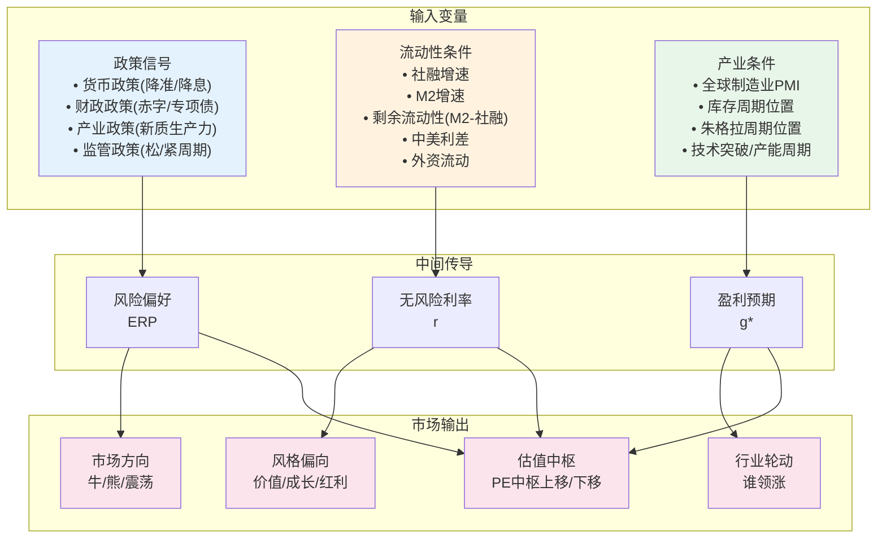
```mermaid
graph TB
    subgraph 输入变量
        V1["政策信号<br/>• 货币政策(降准/降息)<br/>• 财政政策(赤字/专项债)<br/>• 产业政策(新质生产力)<br/>• 监管政策(松/紧周期)"]
        V2["流动性条件<br/>• 社融增速<br/>• M2增速<br/>• 剩余流动性(M2-社融)<br/>• 中美利差<br/>• 外资流动"]
        V3["产业条件<br/>• 全球制造业PMI<br/>• 库存周期位置<br/>• 朱格拉周期位置<br/>• 技术突破/产能周期"]
    end

    subgraph 中间传导
        M1["风险偏好<br/>ERP"]
        M2["无风险利率<br/>r"]
        M3["盈利预期<br/>g*"]
    end

    subgraph 市场输出
        O1["市场方向<br/>牛/熊/震荡"]
        O2["风格偏向<br/>价值/成长/红利"]
        O3["行业轮动<br/>谁领涨"]
        O4["估值中枢<br/>PE中枢上移/下移"]
    end

    V1 --> M1 --> O1
    V2 --> M2 --> O2
    V3 --> M3 --> O3
    M1 & M2 & M3 --> O4

    style V1 fill:#e3f2fd
    style V2 fill:#fff3e0
    style V3 fill:#e8f5e9
    style O1 fill:#fce4ec
    style O2 fill:#fce4ec
    style O3 fill:#fce4ec
    style O4 fill:#fce4ec
```

### 5.6 当前配置共识汇总

| 方向                     | 配置逻辑                     | 适用的周期阶段     | 风险点                |
| ---------------------- | ------------------------ | ----------- | ------------------ |
| **高股息/红利资产**           | 利率中枢下移背景下"类债券"替代品；险资持续买入 | 类衰退→类复苏过渡期  | 若经济超预期复苏→成长爆发→红利跑输 |
| **新质生产力（半导体/AI/高端制造）** | 朱格拉周期+国产替代+技术突破三重共振      | 信用修复+产业周期上行 | 技术封锁升级、研发不及预期      |
| **全球制造业共振品种（出海链）**     | 全球补库周期+中国制造竞争力           | 全球PMI上行期    | 关税壁垒、地缘政治风险        |
| **贵金属/有色金属**           | 美元信用裂痕+全球央行购金+补库需求       | 全球不确定性上升期   | 美元超预期走强、和平预期       |

> 天风证券总结：**"耐心资本：红利为盾，新质生产力为矛"**——在盈利底确认之前，红利提供安全垫；在朱格拉周期和全球制造业共振的加持下，新质生产力提供弹性。

***

## 6. 近年来的重大改革及影响

### 6.1 改革全景：A股制度变革的"三进三出"

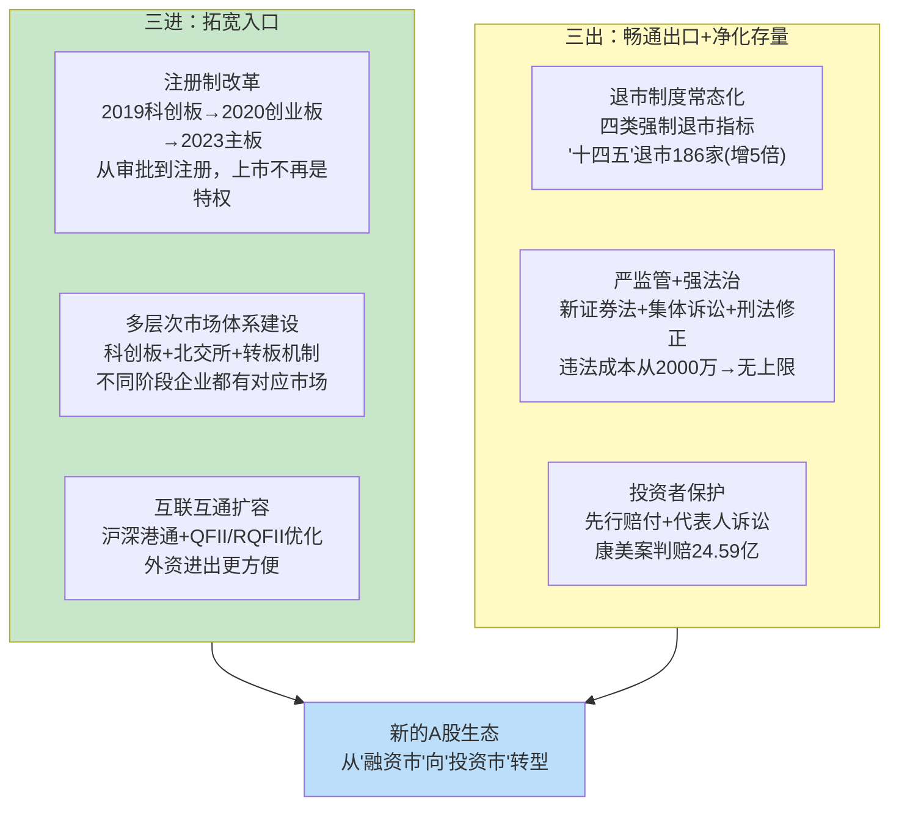
```mermaid
graph TB
    subgraph 三进["三进：拓宽入口"]
        IN1["注册制改革<br/>2019科创板→2020创业板→2023主板<br/>从审批到注册，上市不再是特权"]
        IN2["多层次市场体系建设<br/>科创板+北交所+转板机制<br/>不同阶段企业都有对应市场"]
        IN3["互联互通扩容<br/>沪深港通+QFII/RQFII优化<br/>外资进出更方便"]
    end

    subgraph 三出["三出：畅通出口+净化存量"]
        OUT1["退市制度常态化<br/>四类强制退市指标<br/>'十四五'退市186家(增5倍)"]
        OUT2["严监管+强法治<br/>新证券法+集体诉讼+刑法修正<br/>违法成本从2000万→无上限"]
        OUT3["投资者保护<br/>先行赔付+代表人诉讼<br/>康美案判赔24.59亿"]
    end

    三进 --> E["新的A股生态<br/>从'融资市'向'投资市'转型"]
    三出 --> E

    style 三进 fill:#c8e6c9
    style 三出 fill:#fff9c4
    style E fill:#bbdefb
```

### 6.2 全面注册制改革（2019—2023）——改写A股的"DNA"

#### 注册制"三步走"全景

| 步骤      | 时间         | 板块  | 首批数量 | 核心突破                    | 关键制度创新                    |
| ------- | ---------- | --- | :--: | ----------------------- | ------------------------- |
| **第一步** | 2019年7月22日 | 科创板 |  25家 | 注册制从零到一；允许未盈利企业上市       | 市场化询价、前5日不设涨跌幅、±20%涨跌幅    |
| **第二步** | 2020年8月24日 | 创业板 |  18家 | 注册制扩至存量板块（800+存量公司一并扩板） | 存量改革最难——800+老公司一夜之间切换交易制度 |
| **第三步** | 2023年4月10日 | 主板  |  10家 | 全面注册制落地，核准制画上句号         | 主板保持±10%（稳妥过渡），全面统一审核标准   |

#### 注册制 vs 核准制——核心差异对比

| 维度       | 核准制（2000-2023）           | 注册制（2023-）               |
| -------- | ------------------------ | ------------------------ |
| **核心理念** | 政府替投资者判断企业"好不好"          | 企业保证信息披露"真不真"，投资者自己判断    |
| **审核主体** | 证监会发审委                   | 交易所审核 + 证监会注册            |
| **上市条件** | 单一盈利标准（主板要求3年连续盈利+净利>2亿） | 多元化标准（市值+收入+现金流+技术优势等多套） |
| **定价机制** | 23倍PE隐形天花板（行政指导）         | 市场化询价（机构报价决定）            |
| **审核周期** | 不确定（排队1-3年常见）            | 3-6个月（可预期）               |
| **壳价值**  | 高（借壳上市是捷径，壳价值曾达20-30亿）   | 趋于归零（上市不再稀缺）             |

#### 注册制带来的结构性变化

| 维度            | 注册制前（2019年前） | 注册制后（2024年）            | 变化趋势            |
| ------------- | ------------ | ---------------------- | --------------- |
| 新经济板块在A股总市值占比 | 约13%（2010年）  | 约30%（2022年）            | ↗ 新兴产业加速上市      |
| IPO定价自由度      | 23倍PE天花板     | 市场化定价（科创板平均PE约60-120倍） | ↗ 定价更反映市场需求     |
| "壳"资源价值       | 20-30亿/个     | 快速缩水至5亿以下              | ↘ A股最顽固的定价扭曲被消除 |
| 科创板占A股融资      | 0%（尚未设立）     | 14.49%（"十四五"期间）        | ↗ 硬科技获资本支持      |
| 未盈利企业上市       | 制度上不可能       | 科创板+创业板+北交所均已允许        | ↗ 创新企业获得国内上市通道  |
| 新股破发率         | \~5%以下       | \~30-50%（科创板/创业板部分时段）  | ↗ 市场化定价 → 破发常态化 |

> **荀玉根（海通证券）的判断**：全面注册制将带来两大深远变化——①行业结构**新兴化**（从金融地产消费主导→科技制造主导）；②估值和交易结构**龙头化**（小盘股"壳溢价"消失，龙头获得流动性溢价）。

### 6.3 退市制度——"宽进严出"的关键一役

#### A股退市制度演变

```
1999年前：基本无退市制度
2001年：PT水仙成为A股首家退市公司（首开先河）
2014年：明确四类强制退市指标（交易类/财务类/规范类/重大违法类）
2018年：长生生物因疫苗事件被强制退市——重大违法退市首例
2020年：新退市制度——取消暂停上市和恢复上市，堵住"停而不退"漏洞
2024年：第三个国九条——退市力度前所未有的加强
```

#### A股退市数量年表（逐年加速）

```
年份        退市数量    标志性事件
2019         10家      退市新规酝酿
2020         16家      新退市制度出台
2021         20家      退市常态化起步
2022         46家      退市加速——接近前三年总和
2023         45家      稳定在较高水平
2024         74家      退市大年（截至统计时）
────────────────────
"十四五"    186家      较"十三五"增长约5倍
```

| 对比维度    | "十三五"（2016-2020） | "十四五"（2021-2025） |     增长    |
| ------- | :--------------: | :--------------: | :-------: |
| 退市总数    |       \~37家      |     **186家**     | **+402%** |
| 年均退市    |       \~7家       |       \~37家      |   +429%   |
| 退市占IPO比 |       \~3%       |       \~12%      |   仍严重偏低   |

#### A股四类强制退市指标（2024年最新版）

```
第一类：交易类强制退市
  • 连续20个交易日收盘价低于1元（"面值退市"——最常用）
  • 连续20个交易日总市值低于3亿元（主板）/ 低于规定标准
  • 连续120个交易日累计成交量低于规定标准

第二类：财务类强制退市
  • 年报净利润为负+营收低于1亿元（主板）/ 更低（科创板/创业板）
  • 年报净资产为负
  • 被出具无法表示意见或否定意见的审计报告

第三类：规范类强制退市
  • 未按期披露年报/半年报
  • 半数以上董事无法保证年报真实性
  • 信息披露或规范运作存在重大缺陷

第四类：重大违法类强制退市
  • 欺诈发行
  • 重大信息披露违法（如财务造假超一定比例）
  • 涉及国家安全/公共安全/生态安全等领域的重大违法
```

#### 董登新（武汉科技大学）的改革建议

> 核心建议：**取消退市公司"重新上市"的后门条款**。
>
> 逻辑：当前退市公司可以通过"老三板→重新申请上市"的通道回到A股（例如长油5→招商南油2019年重新上市）。这严重削弱了退市的惩戒效应——退市不是死刑，而是"换个地方休养"。真正的退市常态化，应该是**退市=重新走完整IPO排队的正门**。

### 6.4 多层次资本市场体系——"大三层+小三层"

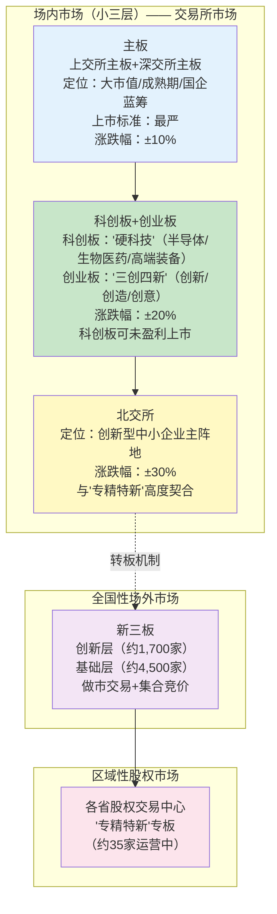
```mermaid
graph TB
    subgraph 场内市场["场内市场（小三层）—— 交易所市场"]
        MB["主板<br/>上交所主板+深交所主板<br/>定位：大市值/成熟期/国企蓝筹<br/>上市标准：最严<br/>涨跌幅：±10%"]
        KCB_CYB["科创板+创业板<br/>科创板：'硬科技'（半导体/生物医药/高端装备）<br/>创业板：'三创四新'（创新/创造/创意）<br/>涨跌幅：±20%<br/>科创板可未盈利上市"]
        BJS["北交所<br/>定位：创新型中小企业主阵地<br/>涨跌幅：±30%<br/>与'专精特新'高度契合"]
    end

    subgraph 场外市场["全国性场外市场"]
        NEEQ["新三板<br/>创新层（约1,700家）<br/>基础层（约4,500家）<br/>做市交易+集合竞价"]
    end

    subgraph 区域性["区域性股权市场"]
        REG["各省股权交易中心<br/>'专精特新'专板<br/>（约35家运营中）"]
    end

    MB --> KCB_CYB
    KCB_CYB --> BJS
    BJS -.->|转板机制| NEEQ
    NEEQ --> REG

    style MB fill:#e3f2fd
    style KCB_CYB fill:#c8e6c9
    style BJS fill:#fff9c4
    style NEEQ fill:#f3e5f5
    style REG fill:#fce4ec
```

#### 各板块关键数据对比

| 板块      | 设立时间    | 上市公司数（估） | 总市值（万亿元，估） |   累计融资（万亿元）   | 核心定位   |
| ------- | ------- | :------: | :--------: | :-----------: | ------ |
| **主板**  | 1990    |  \~3,200 |    \~60    |       —       | 国民经济支柱 |
| **科创板** | 2019.7  |   \~570  |    \~6.5   |  >0.8（"十四五"）  | 硬科技    |
| **创业板** | 2009.10 |  \~1,300 |    \~12    |       —       | 创新创业   |
| **北交所** | 2021.9  |   \~250  |    \~0.4   | >0.048（"十四五"） | 专精特新   |

### 6.5 互联互通与国际化——从"封闭市场"到"全球配置标的"

#### 外资进入A股的四大通道演进

```mermaid
timeline
    title 外资进入A股的开放历程
    2002 : QFII试点<br/>额度仅~40亿美元
    2011 : RQFII试点<br/>人民币渠道开放
    2014 : 沪港通<br/>外资直投A股里程碑(额度3000亿)
    2016 : 深港通<br/>覆盖深市
    2018 : MSCI纳入<br/>全球被动资金入场
    2019 : QFII额度取消<br/>外资入场再无上限
    2024 : 沪深港通持续扩容<br/>交易标的覆盖超80%市值
```

#### 外资对A股定价权的影响

| 指标          | 2016年（深港通前） |      2020年     |  2025年（估） |
| ----------- | :---------: | :------------: | :-------: |
| 陆股通外资持股总市值  |   \~0.3万亿   |     \~2.3万亿    |  \~2.5万亿  |
| 占A股流通市值比    |    \~0.5%   |     \~3.5%     |   \~2.6%  |
| 外资对消费龙头持股   |     <5%     |     10-20%     |   10-20%  |
| 外资定价权（边际影响） |     几乎为零    | 显著（白马股边际定价者之一） | 与国内机构并驾齐驱 |

> **外资的行为特征**：偏好ROE>15%+现金流稳定+治理规范的龙头公司（重仓茅台、宁德、美的、招行等）；换手率远低于散户和国内机构；通常在A股低估时系统性加仓、高估时减仓——起到了一定的"价值锚"作用，但体量仍不足以扭转散户主导的定价格局。

### 6.6 法治保障——从"罚酒三杯"到"倾家荡产"

| 里程碑           | 时间        | 核心变化                                   | 标志性案例                          |
| ------------- | --------- | -------------------------------------- | ------------------------------ |
| **旧《证券法》**    | 1999-2019 | 欺诈发行最高罚60万，虚假陈述最高罚60万                  | "60万顶格罚款"成笑谈                   |
| **新《证券法》**    | 2020.3    | 欺诈发行最高罚募集资金的1倍（无上限）；虚假陈述最高罚1000万       | 广东榕泰被罚300万（首批适用新法）             |
| **刑法修正案（十一）** | 2021.3    | 欺诈发行最高刑期从5年提至**15年**；违规披露最高刑期提至**10年** | —                              |
| **集体诉讼制度**    | 2020-     | 特别代表人诉讼——投保机构可代表全体投资者起诉                | **康美药业案**：判赔24.59亿元，5.2万名投资者获赔 |
| **先行赔付机制**    | —         | 保荐机构先行赔付投资者损失                          | 兴业证券先行赔付欣泰电气投资者                |

> **康美药业的标志意义**：造假300亿→24.59亿民事赔偿+实控人被判刑→首例特别代表人诉讼。这是中国版"集体诉讼"从纸面走向现实的关键案例。

### 6.7 改革成效与不足——一个公允的评判

#### ✅ 改革成效

| 领域      | 具体数据                                                    |
| ------- | ------------------------------------------------------- |
| 上市公司数量  | 从约3,500家（2018）→ 超5,300家（2025），覆盖更多新兴产业                  |
| 新经济市值占比 | 从13%（2010）→ 30%（2022），市值结构更加反映经济转型                      |
| 分红回购力度  | 现金分红"十四五"超8万亿（较"十三五"增近80%）；回购5,764亿（增超147%）             |
| 机构化进程   | 境内机构持股占比从16.59%（2021Q1）→ 18.46%（2025Q1）；个人交易占比首次降至70%以下 |
| 退市加速    | "十四五"退市186家（"十三五"的5倍）                                   |
| 法治升级    | 违法成本从"60万封顶"到"无上限+15年刑期+集体诉讼"                           |

#### ⚠️ 现存不足（田轩，清华大学）

| 不足          | 具体表现                       | 改进方向           |
| ----------- | -------------------------- | -------------- |
| 中小企业融资难     | 大量中小微企业仍无法进入资本市场           | 北交所容量扩大、转板机制优化 |
| 资金流向"脱实向虚"  | 部分资金在金融体系内空转               | 穿透式监管+引导资金直达实体 |
| 服务创新包容性不足   | VIE架构/未盈利硬科技企业上市仍有障碍       | 进一步放宽上市条件      |
| 信披质量有待提高    | 部分注册制新股"带病上市"              | 压实中介机构责任、加大处罚  |
| 国际化水平偏低     | 外资持股仅\~4-5%，远低于日韩台（30-40%） | 沪深港通扩容+QFII改革  |
| 中长期资金入市实效不足 | 养老金/险资入市仍有堵点               | 打通制度堵点+税收优惠激励  |

***

## 7. 总结：A股的底层逻辑是什么

### 7.1 一句话定义

> **A股的本质是一个"制度供给 + 流动性周期 + 产业政策"三维博弈系统，其运行逻辑由政策周期定方向、信用/流动性周期定节奏、产业周期定结构。**

```mermaid
graph TB
    subgraph 核心公式["A股 = f(制度·ERP, 流动性·r, 产业·g*)"]
        A["制度供给<br/>• 注册制/退市/法治<br/>• 国九条/中特估<br/>• 对外开放/互联互通<br/>→ 决定了ERP的方向"]
        B["流动性周期<br/>• 货币政策/信用周期<br/>• 剩余流动性<br/>• 外资/杠杆资金<br/>→ 决定了r的波动"]
        C["产业周期<br/>• 朱格拉周期<br/>• 全球制造业周期<br/>• 技术突破周期<br/>→ 决定了g*的预期"]
    end

    A --> D["市场定价<br/>短期：政策>流动性>基本面<br/>中期：流动性>政策>基本面<br/>长期：基本面>政策>流动性"]
    B --> D
    C --> D

    style A fill:#e3f2fd
    style B fill:#fff3e0
    style C fill:#e8f5e9
    style D fill:#fce4ec
```

### 7.2 理解A股的七个核心命题（深度论证版）

#### 命题一：政策是第一驱动力

> 政策变化直接改变市场的风险溢价（ERP），这是A股区别于成熟市场最根本的特征。

**论据**：

- A股年均约12次重大政策调整，远超美股（约3-4次/年）
- 每一次历史性底部都对应着重大政策信号（2005年股改→998点；2014年国九条+降息→1974点；2018年民企座谈会→2440点；2024年国九条+9月组合拳→2635点）
- 每一次历史性顶部都伴随着政策收紧（2007年印花税半夜上调→6124点；2015年配资清理→5178点）
- **政策通过ERP渠道影响的是整个估值中枢，而非个股——这也是A股比美股更容易出现"齐涨齐跌"的制度原因**

#### 命题二：散户边际定价，产业资本决定筹码归属

> 持仓上产业资本（约43%）和散户（约40%）是双主体，但交易上散户占70%+。这意味着短期价格由散户情绪驱动，中长期方向由产业资本行为（增减持、回购、分红）决定。

**论据**：

- 小资金（<10万）账户98%亏损 vs 大资金（>1000万）99%盈利——散户在交易层面系统性输给机构和产业资本
- 产业资本减持潮往往对应市场顶部（2007、2015、2020-2021），增持/回购潮往往对应市场底部（2008、2018、2024）
- **A股最大的"暗线"不是技术分析，不是宏观判断，而是产业资本的增减持方向**

#### 命题三："政策底→信用底→市场底→盈利底"是经典传导链

> 利好政策是"量变"，信用和基本面数据的验证才是"质变"。

**论据**：

- 2008年、2014年、2019年、2024年四轮周期的复盘数据支持这一传导链
- 时滞通常为1-6个月
- **当前（2025年）处于"市场底→盈利底"的过渡阶段，等待PPI和企业盈利的质变信号**

#### 命题四：流动性定价从"海外定价"切换为"国内定价"

> 过去A股估值受美债利率和利差倒挂严重制约；2024年起国内利率下行和社融修复成为更重要的定价因子。

**论据**：

- 2021-2023年中美利差倒挂导致外资流出和估值承压
- 2024年国内降息力度加大且社融修复，国内因素重夺定价权
- **这不是短期现象，而是中国货币政策独立性增强的长期趋势**

#### 命题五：定价叙事从"增长叙事"转为"竞争力叙事"

> 市场不再简单看GDP增速，而是看龙头企业在全球关键赛道（AI、半导体、新能源）的竞争胜率——定价的是永续增长预期g\*，而非当期盈利。

**论据**：

- 宁德时代市值超茅台成为A股市值冠军——资本市场市值龙头从白酒变新能源，是叙事转换的标志性事件
- 前10%公司贡献A股市值60-70%——市场结构本身就在执行"竞争力筛选"
- **传统宏观指标（GDP、社会零售、居民收入）对A股的指示意义系统性下降**

#### 命题六：制度不对称是"散户98%亏损"的结构性根源

> T+1 vs 变相T+0套利、涨跌停聚集效应、做空受限 vs 量化微秒响应——这些机制不对称使散户处于天然劣势。

**论据**：

- T+1锁定散户24小时，机构/游资可通过底仓滚动实现变相T+0
- 涨跌停创造"打板"文化，"打板一时爽，五天火葬场"
- 量化交易占成交额29%，散户信号延迟至少300ms
- **这些制度设计初衷是"保护散户"，但实际效果是制造了新的不对称——保护性制度反而保护了专业投资者对散户的收割**

#### 命题七：改革方向是"融资市→投资市"，但以十年为单位

> 注册制解决"入口"问题，退市常态化解决"出口"问题，中长期资金入市改善投资者结构，集体诉讼和严监管保护投资者。

**论据**：

- 注册制从试点到全面落地用了5年（2019-2023），但真正"磨合成熟"需要再一个5年
- 退市率从0.3%提升至1%用了5年，要提升至3-5%还需要更长时间
- 养老金/长线资金入市从"鼓励"到"建立机制"，但体量达到美股的35%占比需要10-20年
- **"制度建设在加速，但市场生态的质变需要十年为单位的时间"——这是理解A股改革节奏的关键认知**

### 7.3 核心矛盾与改革方向——"五对矛盾"的分析框架

| 矛盾           | 现状                      | 理想状态                    | 改革路径               |  预计时间 |
| ------------ | ----------------------- | ----------------------- | ------------------ | :---: |
| **散户 vs 机构** | 散户交易70%+，机构持股不足20%      | 机构交易>50%，养老金占比>20%      | 个人养老金扩容、ETF发展、投顾制度 | 5-15年 |
| **做多 vs 做空** | 做空工具仅成熟市场1/5            | 做空工具丰富、多空力量平衡           | 个股期权推出、融券市场化       |  3-5年 |
| **进口 vs 出口** | IPO年均300-400 vs 退市40-50 | IPO与退市保持动态平衡            | 退市常态化、取消重新上市后门     |  3-5年 |
| **短期 vs 长期** | 基金持仓1.8年、散户持股30天        | 基金考核3-5年、散户通过基金/ETF间接投资 | 考核周期改革、税收激励        | 5-10年 |
| **监管 vs 市场** | 每年12次政策调整，"政策市"特征明显     | 政策可预期、规则驱动              | 法治化、减少窗口指导         | 5-15年 |

### 7.4 给不同类型投资者的框架应用建议

| 投资者类型           | 关注重点              | 核心框架               | 典型策略                     |
| --------------- | ----------------- | ------------------ | ------------------------ |
| **短期交易者（<1年）**  | 政策信号+流动性边际变化+市场情绪 | 政策底→市场底传导 + 信用四象限  | 关注政策窗口期、社融拐点、北向资金流向      |
| **中期投资者（1-3年）** | 信用周期+盈利周期+行业景气    | 信用投资时钟 + 产业周期      | 在类复苏象限加仓成长，类滞胀切换价值       |
| **长期投资者（>3年）**  | 朱格拉周期+全球竞争力+制度变革  | 竞争力叙事 + 中特估 + 双重重估 | 配置新质生产力龙头+红利底仓+全球制造业共振品种 |
| **海外投资者**       | 中美利差+汇率+政策可预期性+治理 | AH溢价 + 外资进出便利度     | 港股价值+沪深港通重仓+寻找治理改善的国企    |

### 7.5 结语

```
中国A股是一个只有35年历史的"青年"市场——
它经历过从零到全球第二的飞速扩张，也经历过6124到1664的惨烈暴跌；
它拥有了全球最庞大的散户群体，也承受着由此带来的非理性波动；
它正在经历从"审批制"到"注册制"的制度基因重塑，也正在从"融资市"向"投资市"艰难转身。

理解A股的底层逻辑，不是背公式，而是理解这五个字：
"制度在塑造市场。"

每一次国九条、每一次注册制扩围、每一次退市新规——
都在一点一点地改变这个市场的基因。

而真正的投资机会，
往往就藏在制度变革与市场惯性之间的"认知差"里。
```

> ⚠️ **风险提示**：若中美关系恶化、全球秩序重构超预期、AI等关键技术进展低于预期、居民资产负债表修复慢于预期，风险溢价的抬升可能超过永续增长预期的改善，导致估值中枢承压。以上框架均为分析工具，不构成任何投资建议。
>
> ⚠️ **免责声明**：本报告仅为信息调研与框架梳理，所有观点来自对公开信息的整理和归纳，**不构成任何投资建议**。市场有风险，投资需谨慎。投资决策请基于个人风险承受能力和专业判断。

***

## 主要参考来源

1. 金融时报，《中国资本市场：从零起步到全球第二大股市的飞跃》，2024年10月
2. 吴晓求（中国人民大学），《中国资本市场三十年——三座丰碑，一个目标》
3. 金融时报，《资本市场发展史也是一部改革史》，2025年12月
4. 中国经济网，《改革激荡三十年 A股整装再出发》，2020年10月
5. 中国证券报，《资本市场制度建设迈向新阶段》，2023年3月
6. 长城证券 汪毅，《推动资本市场的"飞轮"：制度改革与生态重塑》，2025年11月
7. 东方财富，《A股市场的波动性特征及制度优化建议》
8. 观察者网，《为什么大A发展了几十年，博弈本质依然浓？》
9. 和讯基金，《A股是什么？A股的特点有哪些？》，2025年1月
10. 中泰证券 李迅雷，《股指连阳，"春季躁动"背后的逻辑》
11. 中金公司，《探索建立具有中国特色的估值体系》，2022年11月
12. 中国银河证券，《中国资产的"双重"重估》
13. 天风证券，《涨价：强主线，硬逻辑》，2026年3月
14. 国信证券，策略研究报告
15. 申万宏源 赵伟，《非典型复苏将至，"资金再平衡"重塑A股价值》，2025年12月
16. FX168，《A股、港股、美股交易制度有何不同？》
17. 格隆汇，《港股、美股、A股"淘汰"机制有何特点》
18. 界面新闻，《多地上市中A股、港股、美股的差异性究竟在哪？》
19. 天风证券，《向新重塑，耐心资本》
20. 西部证券，《基于信用周期的A股投资框架》
21. 东吴证券，《信用周期失效？全球制造业周期指引A股新航向》，2024年6月
22. 国金证券，朱格拉周期系列研报
23. 荀玉根（海通证券），《全面注册制的影响和建议》
24. 东方财富，《"十四五"资本市场制度重塑》，2025年8月
25. 新浪财经，《中国特色资本市场系列研究：注册制加速推进资本市场层次分化和一体化》
26. 清华大学田轩，关于资本市场改革的系列公开论述
27. 武汉科技大学董登新，关于退市制度改革的公开建议

